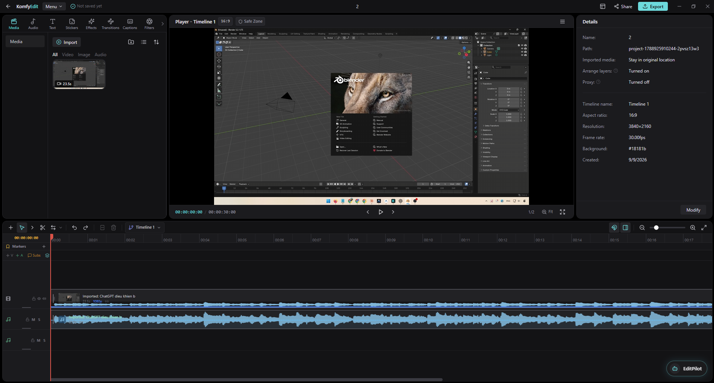

# KomfyEdit

KomfyEdit is an open-source desktop video editor. It runs fully offline — no account, no API key, no GPU, no network calls. Import your media, cut it on a multi-track timeline, and export with the bundled ffmpeg.

<p align="center">
  
</p>

## 📖 Documentation / Tài liệu hướng dẫn

- 🇺🇸 **[English Documentation](docs/en/README.md)**: [User Guide](docs/en/user-guide/01-getting-started.md) · [Developer Guide](docs/en/developer-guide/01-architecture-overview.md) · [Contributing](docs/en/developer-guide/05-contributing.md)
- 🇻🇳 **[Tài liệu Tiếng Việt](docs/vi/README.md)**: [Hướng dẫn sử dụng](docs/vi/user-guide/01-getting-started.md) · [Hướng dẫn lập trình](docs/vi/developer-guide/01-architecture-overview.md) · [Đóng góp mã nguồn](docs/vi/developer-guide/05-contributing.md)
- 📚 **[Documentation Portal](docs/README.md)**: Central directory with full architectural diagrams and workflows.

## Features

**Timeline**

- Multi-track video and audio timeline with multiple named timelines per project
- Select / blade / ripple / roll / slip / slide tools
- Ripple and roll trimming, snapping, linked A/V clips, gap detection and "Close Gap"
- Insert and overwrite edits from the source monitor, match frame, in/out marks
- Copy / cut / paste, duplicate, split at playhead, undo/redo (snapshot history)
- Clip color labels, track lock / mute / solo, adjustment layers

**Clips**

- Speed, reverse, opacity, horizontal/vertical flip
- Color correction (brightness, contrast, saturation, temperature, tint, exposure, highlights, shadows)
- Transitions: dissolve, fade to black/white, wipes
- Letterbox with preset and custom aspect ratios
- Text overlays with presets and full typography controls
- Per-clip volume and mute, waveform display

**Subtitles**

- Dedicated subtitle tracks with per-track styling
- SRT import and export

**Media**

- Import video, image, and audio files; assets are copied into the project
- Asset browser with bins, grid/list views, sorting, filtering, and favorites
- Source monitor and program monitor with JKL shuttle and frame stepping

**Project & export**

- Local project storage with autosave
- Timeline XML export
- Export to H.264 / ProRes / VP9 at a chosen resolution, fps, and quality, with burned-in subtitles

## Architecture

Two layers, no backend server:

- **Frontend** (`frontend/`): React 18 + TypeScript + Tailwind renderer. The editor lives in `frontend/views/VideoEditor.tsx` and `frontend/views/editor/**`, backed by a Zustand store with domain selectors and actions.
- **Electron** (`electron/`): main process — app lifecycle, IPC, file dialogs, media import, thumbnails, and ffmpeg export.

`shared/electron-api-schema.ts` is the single Zod-typed contract between the two; the preload script derives `window.electronAPI` from it.

ffmpeg ships with the app via the `ffmpeg-static` package, and is also used for image thumbnails and dimension probing. If the bundled binary is missing, KomfyEdit falls back to an `ffmpeg` on your `PATH`.

## Development

Prereqs: Node.js 20+ and pnpm.

```bash
pnpm install
```

Run in development (Vite + Electron):

```bash
pnpm dev
```

Typecheck:

```bash
pnpm typecheck
```

Build an installer for the current platform:

```bash
pnpm build
```

Build an unpacked app directory (faster, for testing):

```bash
pnpm build:dir
```

## Skill Evaluation Suite (`eval:skills`)

KomfyEdit features an automated evaluation harness for AI editing skills (such as `cut-silence`):

```bash
pnpm eval:skills
```

This runs all benchmark scenarios against the MCP server and asserts machine-checkable invariants:
- Expected duration reduction (e.g. 10%–25%)
- No micro-clips produced (all clips $\ge$ 0.5s)
- Magnetic V1 timeline contiguity (no audio/video gaps on V1)
- Zero quality control violations (`qc.check` returns 0 issues)
- Strict fail-closed rejection on locked tracks / negative destructive prompts

### How to Add a New Scenario

To add a new scenario to `scripts/eval-skills.ts`:
1. Open `scripts/eval-skills.ts`.
2. Define a new scenario block within `runSkillEvaluations()`:
   ```ts
   // SCENARIO N: <Description>
   {
     const start = Date.now()
     const invariants: ScenarioResult['invariants'] = []
     // 1. Create fixture project with projectSchema.parse(...)
     // 2. Call tool (e.g., observe.silence, edit.propose, render.preview)
     // 3. Assert machine-checkable invariants
     results.push({
       id: 'scenario-n-name',
       name: 'Human-readable description',
       passed: invariants.every(i => i.passed),
       durationMs: Date.now() - start,
       invariants,
     })
   }
   ```
3. Run `pnpm eval:skills` to verify all invariants pass and view the formatted evaluation table.

## License

Apache-2.0. See [LICENSE.txt](LICENSE.txt) and [NOTICES.md](NOTICES.md).

