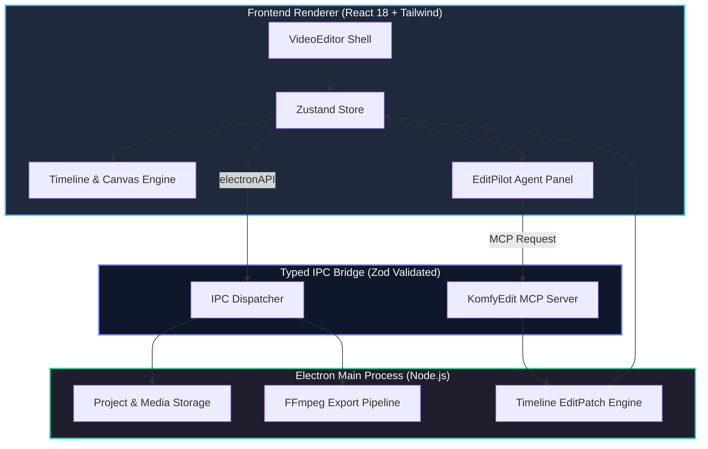

# KomfyEdit Documentation Hub

  

Welcome to the **KomfyEdit** documentation center. KomfyEdit is a modern, lightweight, 100% offline desktop video editor built with **Electron**, **React 18**, **TypeScript**, and bundled **FFmpeg**, featuring a local AI editing agent powered by the **Model Context Protocol (MCP)**.

---

## 🌐 Choose Your Language / Chọn ngôn ngữ

| [English (Primary)](en/README.md) | [Tiếng Việt (Phụ)](vi/README.md) |
|---|---|
| Comprehensive user guides, developer architecture, API specs, and contribution rules. | Hướng dẫn sử dụng toàn diện, kiến trúc lập trình, thông số kỹ thuật và hướng dẫn đóng góp. |
| 👉 **[Browse in English →](en/README.md)** | 👉 **[Xem bằng Tiếng Việt →](vi/README.md)** |

---

## 📚 Table of Contents / Mục lục tổng quan

### 📖 User Guide / Hướng dẫn sử dụng
| # | Topic / Chủ đề | English | Tiếng Việt | Highlights / Điểm nổi bật |
|---|---|---|---|---|
| 01 | **Getting Started / Bắt đầu** | [01-getting-started.md](en/user-guide/01-getting-started.md) | [01-getting-started.md](vi/user-guide/01-getting-started.md) | 100% offline, system requirements, quick project setup |
| 02 | **Workspace & Interface / Giao diện & Workspace** | [02-interface-and-workspace.md](en/user-guide/02-interface-and-workspace.md) | [02-interface-and-workspace.md](vi/user-guide/02-interface-and-workspace.md) | Dual monitor, Editor Library, App & Project settings, i18n |
| 03 | **Timeline & Editing / Timeline & Cắt ghép** | [03-timeline-and-editing.md](en/user-guide/03-timeline-and-editing.md) | [03-timeline-and-editing.md](vi/user-guide/03-timeline-and-editing.md) | Multi-track, Keyframing (`◆`), Gap Actions, Transitions, Blend Modes, Stickers |
| 04 | **Color, Filters & Adjustment Layers / Màu sắc & Lớp điều chỉnh** | [04-color-effects-filters.md](en/user-guide/04-color-effects-filters.md) | [04-color-effects-filters.md](vi/user-guide/04-color-effects-filters.md) | 3D LUT Library, WebGL GPU preview 1:1 FFmpeg parity, custom LUT `.cube`, Adjustment Layer |
| 05 | **Audio & Subtitles / Âm thanh & Phụ đề** | [05-audio-and-subtitles.md](en/user-guide/05-audio-and-subtitles.md) | [05-audio-and-subtitles.md](vi/user-guide/05-audio-and-subtitles.md) | Local Whisper Speech-to-Text, Audio Ducking, Limiter, Boost (+24dB), Text Presets |
| 06 | **Export & Rendering / Xuất video** | [06-export-and-delivery.md](en/user-guide/06-export-and-delivery.md) | [06-export-and-delivery.md](vi/user-guide/06-export-and-delivery.md) | GPU NVENC/QSV/VideoToolbox, 4K/8K Proxy & Render Cache, Batch Queue, Chapters |
| 07 | **EditPilot AI Assistant / Trợ lý AI EditPilot** | [07-editpilot-ai-assistant.md](en/user-guide/07-editpilot-ai-assistant.md) | [07-editpilot-ai-assistant.md](vi/user-guide/07-editpilot-ai-assistant.md) | Live UI Sync, Highlight Extraction, B-Roll Copilot, Whisper transcribe, 22 MCP tools |

---

### 💻 Developer Guide / Hướng dẫn nhà phát triển
| # | Topic / Chủ đề | English | Tiếng Việt |
|---|---|---|---|
| 01 | **Architecture Overview / Kiến trúc hệ thống** | [01-architecture-overview.md](en/developer-guide/01-architecture-overview.md) | [01-architecture-overview.md](vi/developer-guide/01-architecture-overview.md) |
| 02 | **Environment Setup / Thiết lập môi trường** | [02-setup-and-workflow.md](en/developer-guide/02-setup-and-workflow.md) | [02-setup-and-workflow.md](vi/developer-guide/02-setup-and-workflow.md) |
| 03 | **State Management & Store / Quản lý State & Store** | [03-state-and-editor-store.md](en/developer-guide/03-state-and-editor-store.md) | [03-state-and-editor-store.md](vi/developer-guide/03-state-and-editor-store.md) |
| 04 | **MCP Server & Skills / Máy chủ MCP & Kỹ năng AI** | [04-mcp-server-and-skills.md](en/developer-guide/04-mcp-server-and-skills.md) | [04-mcp-server-and-skills.md](vi/developer-guide/04-mcp-server-and-skills.md) |
| 05 | **Contributing Guidelines / Quy chuẩn đóng góp** | [05-contributing.md](en/developer-guide/05-contributing.md) | [05-contributing.md](vi/developer-guide/05-contributing.md) |
| 06 | **Releasing & Auto-Updates / Phát hành & Tự động cập nhật** | [06-releasing-and-updates.md](en/developer-guide/06-releasing-and-updates.md) | [06-releasing-and-updates.md](vi/developer-guide/06-releasing-and-updates.md) |

---

## ⚡ Quick Architectural Highlights

1. **Zero External Backend**: Completely self-contained desktop app with no tracking, cloud accounts, or telemetry.
2. **Bundled Media Engine**: Standalone FFmpeg integration handles decoding, thumbnail generation, waveform extraction, and multi-track rendering.
3. **Deterministic AI Edits**: AI agents manipulate the timeline strictly through atomic, validated, and reversible `EditPatch` operations via MCP.
