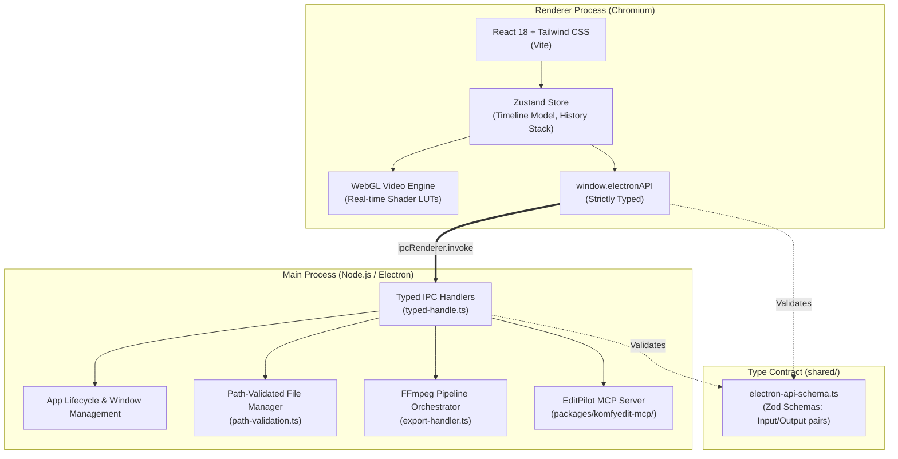

# Architecture Overview

KomfyEdit is built on a clean, decoupled two-layer architecture designed for offline stability, high frame-rate interactive editing, and bulletproof IPC validation.

---

## 🏛️ System Architecture



---

## 🔑 Core Pillars

### 1. Two Layers, No Cloud Backend
KomfyEdit contains no remote servers, telemetry tracking, or cloud authentication. All user projects, cache files, waveforms, and media assets reside exclusively on the user's local disk.

### 2. Typed IPC via Zod
All communication between the renderer and Electron main process flows through `shared/electron-api-schema.ts`. Every single IPC method defines:
```ts
// shared/electron-api-schema.ts
export const electronAPISchemas = {
  getAssetMetadata: {
    input: z.object({ filePath: z.string() }),
    output: z.object({ width: z.number(), height: z.number(), duration: z.number() }),
  },
  // ...
}
```
This guarantees runtime type safety, auto-completion in TypeScript, and complete immunity to malformed messages.

### 3. Path Traversal Protection
Every renderer-supplied file path must pass through `electron/path-validation.ts` to ensure it falls strictly within authorized project roots or imported media locations.

### 4. Bundled FFmpeg Architecture
The desktop binary bundles `ffmpeg-static`. During packaging, Electron rewrites references from `app.asar` to `app.asar.unpacked`. If the packaged binary is unavailable, it gracefully falls back to `ffmpeg` available on system `PATH`.

---

[Next: 02. Development Setup →](02-setup-and-workflow.md)
