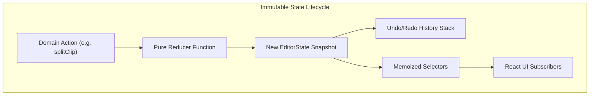

# State Management & Editor Store

The video editor requires sub-millisecond timeline interactivity, frame-accurate playhead tracking, and rock-solid undo/redo history. KomfyEdit implements this using a structured **Zustand** store.

---

## 🏗️ Store Organization

The editor state lives under `frontend/views/editor/` and `core/`:

```
frontend/views/editor/
├── editor-store.tsx        # Zustand store initialization and React Provider
├── editor-state.ts         # EditorState type definitions and initial values
├── editor-selectors.ts     # Memoized domain selectors (pure queries)
└── editor-actions.ts       # Pure immutable state transformation actions
```



---

## ⚡ Golden Rules for Contributors

### 1. Pure Action Functions
All mutations must be implemented as pure functions that accept `(state: EditorState, ...args)` and return a new `EditorState`. Never mutate state properties directly:

```ts
// GOOD
export function updateClipPosition(state: EditorState, clipId: string, newStart: number): EditorState {
  return updateActiveTimeline(state, timeline => ({
    ...timeline,
    clips: timeline.clips.map(clip => 
      clip.id === clipId ? { ...clip, startTime: newStart } : clip
    )
  }))
}

// BAD - direct mutation!
export function badMutation(state: EditorState, clipId: string) {
  state.editorModel.timelines[0].clips[0].startTime = 5 // NEVER DO THIS!
}
```

### 2. High-Performance Hot Paths
The timeline playhead moves at 60Hz. To avoid React re-render thrashing:
- Never construct new object or array references inside selectors unless memoized.
- Keep the playback clock decoupled from heavyweight UI components.
- Use `useCallback` and `React.memo` across timeline clip and track items.

### 3. Snapshot Undo/Redo
The history stack stores timeline state snapshots automatically. When proposing an atomic edit (such as an AI cut sequence or multi-clip ripple delete), wrap all operations in a single history batch so the user can undo the entire operation in a single `Ctrl + Z`.

---

[← Previous: 02. Development Setup](02-setup-and-workflow.md) · [Next: 04. MCP Server & Skills →](04-mcp-server-and-skills.md)
