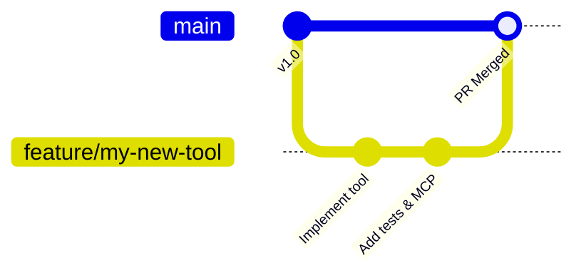

# Contributing to KomfyEdit

Thank you for your interest in contributing to **KomfyEdit**! We are building a truly open, private, and offline desktop video editor, and we welcome bug reports, documentation enhancements, feature proposals, and code contributions.

---

## 🌟 Code of Conduct

We are committed to providing a friendly, safe, and welcoming environment for everyone, regardless of experience level, gender, identity, race, or background. Please treat fellow contributors and maintainers with respect and empathy.

---

## 📋 Ways to Contribute

1. **Report Bugs**: Submit detailed issue reports with reproduction steps and your OS version.
2. **Improve Documentation**: Fix typos, add missing tutorials, translate to other languages.
3. **Submit Bug Fixes & Features**: Open a Pull Request targeting the `main` branch.
4. **Develop AI Skills**: Write new evaluation scenarios and MCP tools in `packages/komfyedit-mcp/`.

---

## 🚀 Pull Request Workflow



1. **Fork the Repository** on GitHub.
2. **Create a Feature Branch**:
   ```bash
   git checkout -b feature/my-new-feature
   ```
3. **Adhere to Code Standards**:
   - Write TypeScript with strict typing enabled.
   - Avoid creating `any` types.
   - Maintain pure function semantics in state actions.
4. **Run Mandatory Verification Checks**:
   ```bash
   # 1. Typecheck frontend and shared packages
   pnpm typecheck

   # 2. Build the frontend production bundle
   pnpm build:frontend

   # 3. If modifying AI tools, run skill benchmarks
   pnpm eval:skills
   ```
5. **Commit with Clear Conventional Commits**:
   - `feat: add roll trim keyboard shortcut`
   - `fix: prevent gap generation on ripple delete`
   - `docs: add adjustment layer visual tutorial`
6. **Open a Pull Request**: Provide a clear description, before/after screenshots or GIFs for UI changes, and link any related issues.

---

## 💬 Communication & Alignment

Before embarking on large architectural overhauls or major UI rewrites, please open an Issue first to discuss your proposal with the maintainers. This ensures your effort aligns with the long-term vision of the project and saves you time!

---

[← Previous: 04. MCP Server & Skills](04-mcp-server-and-skills.md) · [Back to Documentation Hub →](../README.md)
