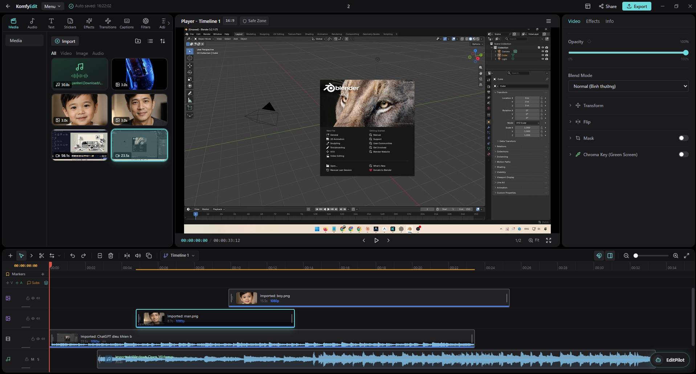
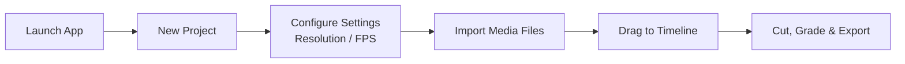

# Getting Started with KomfyEdit

<p align="center">
  
</p>

**KomfyEdit** is an open-source, non-linear video editing desktop application designed for privacy, speed, and local automation. It runs 100% offline on your machine without mandatory cloud accounts, subscriptions, or remote servers.

---

## 💻 System Requirements

| Component | Minimum | Recommended |
|---|---|---|
| **OS** | Windows 10/11 (64-bit), macOS 12+ (Intel / Apple Silicon), Ubuntu 20.04+ | Windows 11, macOS 14+ (M1/M2/M3), Ubuntu 22.04+ |
| **CPU** | 4-core 64-bit x86 or ARM64 processor | 8-core modern processor |
| **RAM** | 8 GB | 16 GB or more |
| **Storage** | 2 GB free disk space (excluding video media) | Fast NVMe SSD |
| **Display** | 1280 × 720 minimum | 1920 × 1080 or higher |

---

## 📥 Installation

### Option 1: Prebuilt Packages (Recommended)

Download the build for your machine from the [GitHub Releases](https://github.com/tuyenhm68/KomfyEdit/releases) page:

| Platform | File |
|---|---|
| Windows 10/11 (64-bit) | `KomfyEdit-<version>-win-x64-Setup.exe` |
| macOS, Apple Silicon (M1–M4) | `KomfyEdit-<version>-mac-arm64.dmg` |
| macOS, Intel | `KomfyEdit-<version>-mac-x64.dmg` |
| Linux (64-bit) | `KomfyEdit-<version>-linux-x86_64.AppImage` or `KomfyEdit-<version>-linux-amd64.deb` |
| Linux (ARM) | `KomfyEdit-<version>-linux-arm64.AppImage` or `KomfyEdit-<version>-linux-arm64.deb` |

> **KomfyEdit is not code-signed yet.** Signing certificates cost money the project does not have, so every platform shows some form of "unknown developer" warning on first launch. Getting past it is a one-time step per installation, described below.

#### Windows

Run the installer. SmartScreen will show *"Windows protected your PC"*: click **More info**, then **Run anyway**. The app launches normally from then on.

#### macOS

Open the `.dmg` and drag KomfyEdit into **Applications**. On first launch macOS refuses to open it, usually with *"KomfyEdit is damaged and can't be opened. You should move it to the Trash."*

Nothing is actually damaged. That is simply the message macOS shows for an app downloaded without a notarized signature. To clear it, open **Terminal** and run:

```bash
xattr -dr com.apple.quarantine /Applications/KomfyEdit.app
```

Then open the app normally.

The command removes the `com.apple.quarantine` flag that macOS attaches to anything downloaded through a browser. It does not disable Gatekeeper, does not change any system setting, and affects only this one app.

If you would rather not use Terminal: double-click the app and let it be blocked, then open **System Settings → Privacy & Security**, scroll to the Security section, and click **Open Anyway** next to the message about KomfyEdit. On macOS 15 Sequoia and later this is the only supported GUI route, since Apple removed the old right-click → Open shortcut for unsigned apps.

> **Auto-update does not work on macOS while the app is unsigned.** `electron-updater` refuses to install an update that is not properly signed, so on macOS you need to download each new `.dmg` yourself. Windows and Linux update themselves normally.

#### Linux

**AppImage** — make it executable, then run it:

```bash
chmod +x KomfyEdit-*-linux-x86_64.AppImage
./KomfyEdit-*-linux-x86_64.AppImage
```

**Debian / Ubuntu** — install with `apt`, which resolves any missing dependencies:

```bash
sudo apt install ./KomfyEdit-*-linux-amd64.deb
```

### Option 2: Running from Source
If you are a developer or prefer running the latest edge build:

1. **Install Prerequisites**:
   - [Node.js](https://nodejs.org/) (version 20 LTS or higher recommended)
   - [pnpm](https://pnpm.io/) package manager (`npm install -g pnpm`)
   - [Git](https://git-scm.com/)

2. **Clone the Repository**:
   ```bash
   git clone https://github.com/tuyenhm68/KomfyEdit.git komfyedit
   cd komfyedit
   ```

3. **Install Dependencies**:
   ```bash
   pnpm install
   ```

4. **Launch Development Mode**:
   ```bash
   pnpm dev
   ```

---

## 🚀 Creating Your First Project

Follow these simple steps to start editing:



1. **Launch KomfyEdit**: The application opens directly to the Home / Project Selection dashboard.
2. **Click "New Project"**:
   - Give your project a clear name (e.g. `My First Vlog`).
   - Select your target aspect ratio:
     - `16:9` (1920×1080 or 3840×2160) for YouTube / TV
     - `9:16` (1080×1920) for TikTok / Reels / Shorts
     - `1:1` (1080×1080) for Instagram feed
   - Choose your timeline framerate (e.g., `24 fps`, `30 fps`, or `60 fps`).
3. **Import Media**:
   - Click the **`+ Import`** button on the top-left Asset Panel or drag-and-drop video, audio, or image files directly from your file manager into the app.
   - Files are indexed with fast waveform and thumbnail generation.
4. **Assemble on the Timeline**:
   - Drag a clip from the Asset Panel down onto the timeline track (`V1` or `A1`).
   - Press `Space` to start and pause playback.

---

[Next: 02. Interface & Workspace →](02-interface-and-workspace.md)
