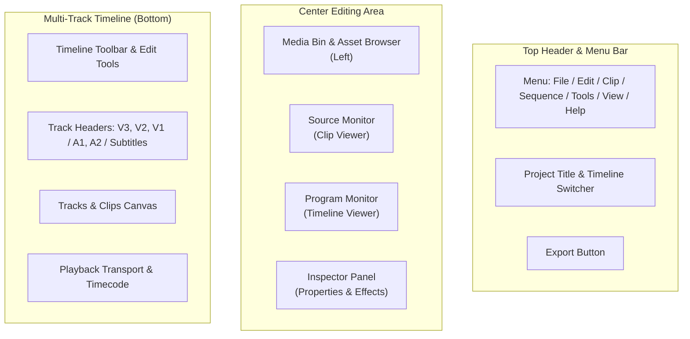

# Interface & Workspace

  

The KomfyEdit workspace is organized into five primary functional panels optimized for high-speed offline non-linear editing.

---

## 🎛️ Workspace Layout

---

## 1. Asset Browser (Media Bin)
Located on the far-left panel:
- **Filters**: Quickly filter assets by **All**, **Video**, **Image**, and **Audio**.
- **Bin Management**: Create hierarchical bins/folders (`+ Bin`) to organize B-Roll, Interviews, Voiceovers, and Music.
- **Color Labels**: Right-click any media item to assign color labels (Blue, Green, Orange, Purple, Cyan, etc.) to visually track media types on the timeline.
- **Search & Sort**: Real-time fuzzy search by filename or metadata, with sorting by Name, Duration, or Date Added.
- **Hover Scrub**: Move your cursor across any video thumbnail to scrub through the frames instantly without opening it.

---

## 2. Dual Monitor System

### Source Monitor (Clip Viewer)
Double-click any clip in your Asset Browser to open it in the Source Monitor:
- Set **In Point** (`I`) and **Out Point** (`O`) to isolate select takes.
- Insert to Timeline using `,` (comma) or Overwrite using `.` (period).
- Clear In/Out marks using `Alt + X`.

### Program Monitor (Timeline Viewer)
Displays the live rendered output of the active timeline playhead:
- **Playback Shuttle Controls**:
  - `J`: Play backward (press repeatedly for 2x, 4x, 8x speed)
  - `K`: Pause playback
  - `L`: Play forward (press repeatedly for 2x, 4x, 8x speed)
- **Frame Stepping**: `Left Arrow` / `Right Arrow` for single frame steps; `Shift + Left/Right` for 1-second jumps.
- **Resolution Scaling**: Switch between `Full`, `1/2`, or `1/4` preview resolution to maintain silky-smooth 60fps playback during complex multi-layer edits on lightweight laptops.

---

## 3. Inspector (Clip Properties Panel)
When any clip on the timeline is selected, the right-hand Inspector displays contextual adjustments:
- **Transform**: Position (X/Y), Scale, Rotation, Opacity, and interactive **Diamond Keyframe** buttons to animate parameters over time.
- **Color Grading**: Brightness, Contrast, Saturation, Temperature, Tint, Exposure, Highlights, and Shadows.
- **Audio**: Volume slider (-60dB to +12dB), Mute, Audio Boost (+24dB), Brickwall Limiter, and Audio Ducking.
- **Speed & Timing**: Speed multiplier (0.1x to 10x) and Reverse video toggle.
- **Blend Modes**: Normal, Multiply, Screen, Overlay, Soft Light, Darken, Lighten, etc.
- **Adjustment Layer Properties**: Assign and tweak 3D LUT filters and Letterbox overlays.

---

## 4. Editor Library Panel
Located on the left sidebar, the Library panel offers instant switching across creative asset types:
- **Media**: Project media files, bins, and adjustment layer assets.
- **Filters**: Extensive 3D LUT filter library grouped into categories (Featured, Cinematic, Retro, Mood, Portrait, B&W...), featuring real-time hover preview, search, favorites, an intensity slider, and an "Apply to All" button.
- **Transitions**: Visual transitions collection (Cross Dissolve, Dip to Black/White, Wipe, Slide, Zoom, Push...) with direct drag-and-drop onto clip edit points.
- **Stickers**: Animated graphics, emojis, arrows, and badge stickers for drag-and-drop timeline overlays.
- **Text Presets**: Pre-styled animated and static titles, captions, and lower-thirds with customizable stroke, shadow, and background box styles.

---

## 5. Application Preferences & Project Settings

### App Preferences (`Ctrl + ,` / `Cmd + ,`)
Accessible via `Edit` → `Preferences` or the gear icon in the title bar:
- **Interface Language**: Switch seamlessly between **English** and **Tiếng Việt**.
- **Hardware Acceleration**: Automatic GPU hardware encoding detection (NVIDIA NVENC, Intel QuickSync, Apple VideoToolbox).
- **Proxy & Render Cache Storage**: Configure local directories for generated lightweight editing proxies and background render cache files, including disk cleanup tools.
- **EditPilot AI Agent Engine**: Select your local CLI provider (Claude Code, Antigravity, or Codex) and safety permissions.

### Project Settings (`File` → `Project Settings...`)
- Modify sequence canvas resolution (1080p, 4K UHD, or vertical 9:16 for TikTok/Shorts/Reels).
- Adjust sequence timebase (24 fps cinematic, 30 fps broadcast, 60 fps gaming/sports).
- View project metadata details: asset count, total storage footprint, and project serialization schema.

---

[← Previous: 01. Getting Started](01-getting-started.md) · [Next: 03. Timeline & Editing →](03-timeline-and-editing.md)
