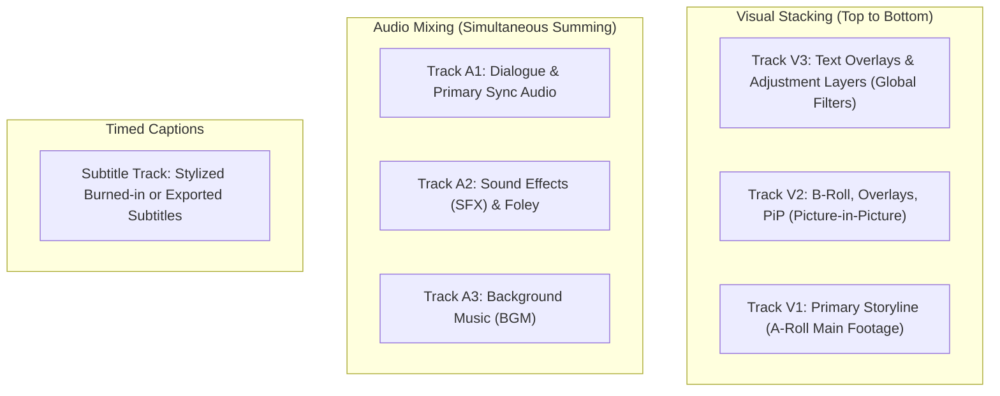
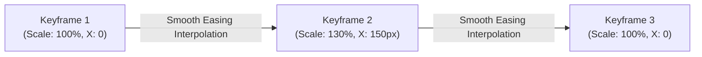

# Timeline & Editing Tools

  

The multi-track timeline is the creative heart of KomfyEdit. It supports simultaneous video, audio, adjustment, and subtitle tracks with industry-standard editing operations.

---

## 🛠️ Editing Tools Overview

Located on the vertical toolbar to the left of the timeline:

| Tool | Shortcut | Icon | Description |
|---|---|:---:|---|
| **Selection Tool** | `V` | ↖ | Select, drag, move, and trim clips normally without shifting adjacent items. |
| **Blade / Razor Tool** | `C` | ✂ | Cut clips at the cursor position or slice all unlocked tracks at playhead. |
| **Ripple Edit Tool** | `B` | ↔ | Trim a clip's In/Out point while automatically shifting all trailing clips forward or backward. |
| **Roll Edit Tool** | `N` | ⧎ | Adjust the cut point between two adjacent clips without changing the overall sequence length. |
| **Slip Tool** | `Y` | ⇥ | Shift the internal media content (source In/Out) without moving the clip's timeline position. |
| **Slide Tool** | `U` | ⇄ | Move a clip between its neighbors, trimming the preceding clip and extending the succeeding clip. |
| **Snapping Toggle** | `S` | 🧲 | Magnetically snap edges to playhead, markers, and adjacent clips. |

---

## 🎞️ Track Architecture & Management

KomfyEdit separates media logically across dedicated tracks:

### Track Controls
Each track header contains controls to manage playback and safety:
- **Lock (`🔒`)**: Prevents any accidental trimming, moving, or blading on that track.
- **Mute (`M`)**: Silences audio tracks during playback and export.
- **Solo (`S`)**: Isolates the selected audio track, muting all others.
- **Hide Video (`👁`)**: Temporarily hides a video track from preview and export rendering.
- **Add Track Buttons**:
  - `+ V`: Add a new video track above the highest track.
  - `+ A`: Add a new audio track below the lowest audio track.
  - `Subs`: Create a dedicated subtitle track.
  - **`Adj`**: Creates an **Adjustment Layer** asset in your Media Bin ready to be placed on any overlay track.

---

## ⚡ Gap Handling & Gap Actions Popover

When blank gaps appear between clips on the timeline, KomfyEdit provides immediate contextual interactions:
- **Left / Right-Click on Gaps**: Opens the **Gap Actions Popover**:
  - **Close Gap (Ripple Delete)**: Collapses the blank space, shifting subsequent clips backward (`Shift + Delete`).
  - **Insert Color / Adjustment Layer**: Spans a solid color or an Adjustment Layer precisely matching the gap's duration without manual trimming.
- **Linked Selection**: When moving or trimming an imported video clip with synchronized audio, both video and audio items move together. Hold `Alt` to trim or move an individual stream independently.
- **Split at Playhead**: Press `Ctrl + K` (Windows/Linux) or `Cmd + K` (macOS) to instantly slice all active unlocked clips at the exact playhead position.

---

## 💎 Motion & Parameter Keyframing

KomfyEdit features an intuitive **Keyframe Animation Engine** allowing smooth parameter interpolation across clips over time:

### How to Create Keyframes:
1. Select a clip on the timeline and position the playhead where you want animation to begin.
2. In the right-hand Inspector, click the **diamond button (`◆`)** next to any animatable property (*Scale*, *Position X/Y*, *Rotation*, *Opacity*, or *Volume*).
   - The diamond illuminates to indicate that keyframe recording is active.
3. Move the playhead to your target timestamp and change the property value. A new keyframe diamond is generated automatically.
4. On the timeline clip body, visual diamond markers show keyframe placements, making timing adjustments effortless.

---

## 🔀 Transitions Library & Blend Modes

### Drag-and-Drop Transitions
Open the **Transitions** tab in the left-hand Library panel:
- **Rich Transition Styles**:
  - **Dissolves**: *Cross Dissolve*, *Dip to Black*, *Dip to White*.
  - **Wipes & Slides**: *Wipe Left/Right/Up/Down*, *Push*, *Slide*.
  - **Motion & Zooms**: *Zoom In/Out*, *Iris*.
- **Applying Transitions**: Drag a transition asset directly from the library onto the boundary between two adjacent clips on any video track.
- **Duration Tuning**: Click on the transition handle on the timeline to drag its edges and adjust transition length (default 0.5s–1.0s).

### Layer Blend Modes
When stacking B-roll, overlays, or graphic elements on tracks `V2` and `V3`:
- In the Inspector → **Blend Mode**, choose:
  - **Normal**: Standard opaque alpha compositing.
  - **Screen / Color Dodge**: Drops black backgrounds, preserving bright highlights (ideal for light leaks, fire, spark overlays, and lens flares).
  - **Multiply / Darken**: Drops white backgrounds, preserving shadows (ideal for vintage paper textures and grunge patterns).
  - **Overlay / Soft Light**: Blends color and contrast for cinematic depth.

---

## 🎨 Stickers & Graphic Overlays

Easily embellish talking-head videos, vlogs, and short-form social reels:
1. Navigate to the **Stickers** tab in the Library panel.
2. Browse categorized graphics: emojis, directional arrows, call-to-action badges (Subscribe / Like / Bell), thought bubbles, and animated icons.
3. **Drag and drop** any sticker onto track `V2` or `V3`.
4. Use the on-screen transform handles in the Program Monitor or the Inspector to resize, position, and combine with **Keyframes** for playful bounce and slide-in animations.

---

## ⌨️ Essential Keyboard Shortcuts Cheat Sheet

| Action | Windows / Linux | macOS |
|---|---|---|
| Play / Pause | `Space` | `Space` |
| Shuttle Rewind / Stop / Forward | `J` / `K` / `L` | `J` / `K` / `L` |
| Step 1 Frame Backward / Forward | `Left` / `Right` | `Left` / `Right` |
| Step 1 Second Backward / Forward | `Shift + Left` / `Shift + Right` | `Shift + Left` / `Shift + Right` |
| Mark In / Mark Out | `I` / `O` | `I` / `O` |
| Clear In / Out | `Alt + X` | `Option + X` |
| Split Clip at Playhead | `Ctrl + K` | `Cmd + K` |
| Delete Selected Clip | `Backspace` or `Delete` | `Delete` |
| Ripple Delete (Delete & Close Gap) | `Shift + Delete` | `Shift + Delete` |
| Undo / Redo | `Ctrl + Z` / `Ctrl + Shift + Z` | `Cmd + Z` / `Cmd + Shift + Z` |
| Zoom In / Out Timeline | `Ctrl + =` / `Ctrl + -` | `Cmd + =` / `Cmd + -` |
| Fit Timeline to View | `Shift + Z` | `Shift + Z` |

---

[← Previous: 02. Interface & Workspace](02-interface-and-workspace.md) · [Next: 04. Color, Effects & Adjustment Layers →](04-color-effects-filters.md)
