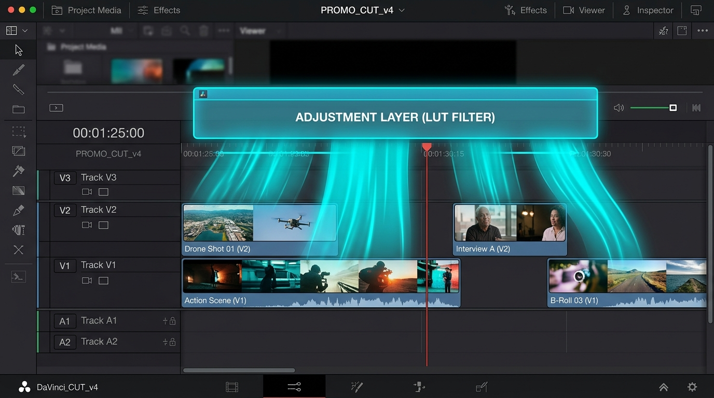
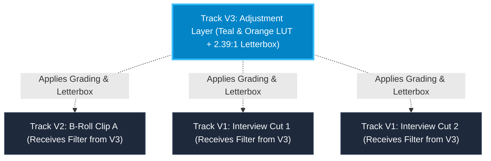
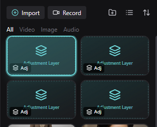
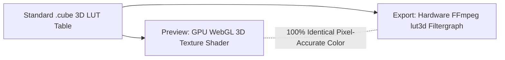

# Color, Effects & Adjustment Layers

  

KomfyEdit features a professional GPU/WebGL-accelerated color grading pipeline, filmic 3D LUT presets, video transitions, and a non-destructive **Adjustment Layer** engine.

---

## 🎨 1. Adjustment Layers Explained

### What is an Adjustment Layer?
An **Adjustment Layer** is a transparent virtual layer that contains no video or image data of its own. Instead, it acts like an optical glass filter placed above your timeline.

> [!TIP]
> Any effect, color grade, 3D LUT filter, or letterbox applied to an Adjustment Layer is **automatically projected onto all video and image clips lying on the tracks beneath it** for the entire duration of that layer.

### Why Do Adjustment Layers Appear in the Media Panel?

  

In KomfyEdit, Adjustment Layers are treated as reusable assets stored in your project's **Media Bin** (marked with a layered icon and the **`Adj`** badge):
1. **Creation Trigger**: Whenever you click the **`Adj`** button on the timeline header or select `Clip` → `Add Adjustment Layer` from the top menu, a new Adjustment Layer asset is added to your Media list.
2. **Reusability**: You can drag this asset from the Media Bin onto any upper track (`V2`, `V3`, etc.) as many times as you want.
3. **Cleaning Up Unused Layers**: If you accidentally clicked `Adj` multiple times, simply hover over the unwanted card in the Media Bin and click the small **Trash** icon (or select it and press `Delete`). Deleting an asset from the media bin does not break existing clips unless they rely on that asset.

### How to Use an Adjustment Layer
1. Click the **`Adj`** button on the timeline track header (or drag an Adjustment Layer card from the Media bin onto track `V2` or `V3`).
2. Drag the handles of the adjustment clip on the timeline to cover the scene or entire project.
3. With the adjustment clip selected, open the **Inspector Panel** on the right side.
4. Choose a **3D LUT Filter** (e.g. *Film Classic*, *Cinematic Warm*, *Moody Cold*) and adjust its **Intensity slider** (0–100%).
5. Watch as every single clip below it immediately adopts the unified color tone!

---

## 🌈 2. Manual Color Correction

You can color grade individual clips or Adjustment Layers directly in the Inspector:

| Parameter | Range | Function |
|---|:---:|---|
| **Exposure** | -2.0 to +2.0 | Adjusts the global light levels of the frame. |
| **Brightness** | -100 to +100 | Linear lift or drop across the luminance spectrum. |
| **Contrast** | -100 to +100 | Expands or compresses the difference between dark and light tones. |
| **Highlights** | -100 to +100 | Recovers blown-out bright regions without affecting shadows. |
| **Shadows** | -100 to +100 | Lifts crushed dark regions without overexposing midtones. |
| **Temperature** | -100 to +100 | Shifts color balance along the Blue (Cool) to Amber (Warm) axis. |
| **Tint** | -100 to +100 | Shifts color balance along the Green to Magenta axis. |
| **Saturation** | 0 to 200% | Controls color intensity from pure monochrome (0%) to vivid (200%). |

---

---

## 🎬 3. Cinema 3D LUT Filters Library

KomfyEdit features a unified color pipeline ensuring 1:1 color accuracy: the **WebGL 3D Texture shader preview** and the **FFmpeg `lut3d` export engine** both consume the exact same source `.cube` tables. What you see in your playback monitor is precisely what renders in your master file!

### Filters Library Highlights
Navigate to the **Filters** tab in the Library panel:
1. **Curated Categories**:
   - **Featured**: Most popular and versatile grading styles.
   - **Cinematic**: Modern film aesthetics (*Teal & Orange*, *Kodak Portra*, *Fuji Chrome*, *Bleach Bypass*...).
   - **Retro & Vintage**: Classic analog 35mm film stock, 80s/90s nostalgia, and warm CCD camera looks.
   - **Portrait**: Flattering skin tone rendition and gentle highlight roll-offs.
   - **Night & Mood**: Deep Moody Emerald greens and atmospheric low-light palettes.
   - **Black & White (B&W)**: Monochrome Noir, contrasty street photography, and classic monochrome.
2. **Search & Favorites**:
   - Search filters instantly by keyword.
   - Click the **Star icon (`★`)** on any thumbnail to add it to your **Favorites** collection for quick 1-click access.
3. **Real-Time Hover Preview**:
   - Hover your mouse over any filter card in the library: the Program Monitor instantly previews the color look on your current playhead frame without altering your project!
4. **Interactive Intensity Slider**:
   - Adjust the **Intensity** slider from `0%` (original clean clip) to `100%` (full grade) directly within the library panel or the Inspector.
5. **Apply to All**:
   - Click **"Apply to All"** to uniformly grade every clip across your active sequence in a single click.
6. **Import Custom 3D LUTs (`.cube`)**:
   - Drag and drop your own `.cube` LUT files directly into the Filters tab to expand your personal grading toolkit.

---

[← Previous: 03. Timeline & Editing](03-timeline-and-editing.md) · [Next: 05. Audio & Subtitles →](05-audio-and-subtitles.md)
