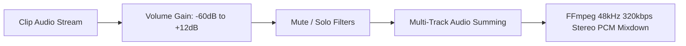
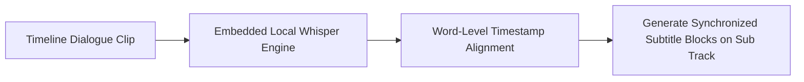

# Audio & Subtitles

  

Crystal-clear sound and accessible captions are critical to every professional video. KomfyEdit provides multi-track audio mixing, visual waveforms, and dedicated subtitle styling tracks.

---

## 🔊 1. Audio Mixing & Waveforms

Every media clip containing audio channels displays a detailed, cached waveform graph directly on the timeline canvas.

### Key Audio Features:
1. **Per-Clip Volume & Audio Boost**:
   - Select any audio or video clip.
   - Adjust the **Volume** slider in the Inspector from `-60 dB` (mute) up to `+12 dB`.
   - **Audio Boost (+24 dB)**: For faint recordings or quiet lavalier microphones, enable the Audio Boost switch for clean amplification.
2. **Brickwall Peak Limiter**:
   - Built-in dynamic limiter automatically compresses transients exceeding 0 dBFS, eliminating harsh clipping and digital distortion on export.
3. **Smart Audio Ducking**:
   - Automatically attenuate background music (BGM on `A3`) whenever dialogue or vocal activity is detected on the primary voice track (`A1`), smoothly raising volume back up during speech pauses.
4. **Audio Track Controls**:
   - **Mute (`M`)**: Silences all clips on that track during playback and final export.
   - **Solo (`S`)**: Listens exclusively to that track while muting all other audio tracks.
5. **Multi-Track Stacking**:
   - Assign Track `A1` for dialogue/speech.
   - Assign Track `A2` for sound effects (SFX) and foley.
   - Assign Track `A3` for background ambient music (BGM).

---

## 🎙️ 2. Auto-Transcription with Local Whisper (100% Offline)

KomfyEdit bundles a local **OpenAI Whisper speech-to-text engine** directly within the desktop app:

- **Zero Cloud & Absolute Privacy**: Speech processing occurs 100% locally on your machine without transmitting any audio over the Internet.
- **How to Use**:
  1. Right-click any audio or video clip on the timeline or choose `Sequence` → `Auto-Transcribe with Whisper`.
  2. Select your source language (English, Vietnamese, or Auto-Detect).
  3. Click **Start Transcription**: The engine parses spoken phrases and creates a ready-to-edit Subtitle track with perfectly aligned timestamps.

---

## 💬 3. Subtitles, Typography & Text Presets

KomfyEdit features a native Subtitle Engine that renders beautiful on-screen text overlays and burns them in cleanly during export.

### Working with Subtitle Tracks
1. Click the **`Subs`** button on the timeline track header to create a dedicated Subtitle track (or generate one via Auto-Transcribe).
2. Double-click anywhere along the subtitle track to add a new subtitle block at the playhead.
3. Type your text directly into the text editor in the Inspector.
4. Drag the subtitle block's start and end handles to synchronize precisely with the speaker's voice.

### Subtitle Styling & Text Presets
Customize the visual presentation of captions across the track or per caption item:
- **Designer Text Presets**: Pick from pre-crafted typography styles (*Cinematic Subtitles*, *Modern Bold*, *Karaoke Highlight*, *Neon Glow*, *Retro Box*).
- **Font Family**: Clean sans-serif, modern serif, or display fonts installed on your OS.
- **Font Size & Weight**: Adjust typography scale, boldness, and slant.
- **Text Color & Gradient**: Solid colors or vibrant gradients.
- **Outline / Stroke**: Add high-contrast outlines (e.g., 2px black outline) to guarantee legibility against bright scenes.
- **Background Box**: Add semi-transparent or solid pill-shaped background boxes behind the captions.
- **Drop Shadows**: Soft or crisp drop shadows for 3D visual pop.
- **Vertical Alignment**: Bottom (default), Center, or Top placement.

---

## 📥 4. SRT Import & Export

Seamlessly collaborate with transcribers or translate captions:

- **Import SRT**: Click `File` → `Import Subtitles (.srt)` or drag an `.srt` file onto the timeline. Captions will automatically populate along a new subtitle track with their original timestamps intact.
- **Export SRT**: Click `Sequence` → `Export Subtitles (.srt)` to generate a standard subtitle text file compatible with YouTube, Vimeo, and video players.

---

[← Previous: 04. Color, Effects & Adjustment Layers](04-color-effects-filters.md) · [Next: 06. Export & Rendering →](06-export-and-delivery.md)
