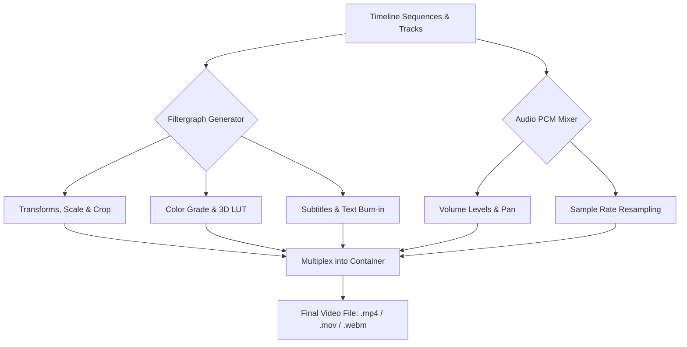
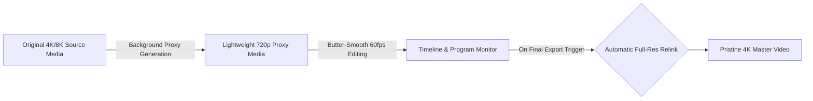

# Export & Rendering

  

KomfyEdit produces pristine master renders completely offline using an embedded, high-performance FFmpeg transcode engine. There are no watermarks, no server queues, and no cloud file uploads.

---

## ⚙️ 1. Opening the Export Dialog

Click the prominent blue **`Export`** button in the bottom-left controls or press `Ctrl + E` (`Cmd + E` on macOS).

---

## 🎥 2. Encoders & Codecs

Choose from professional and web-optimized video codecs:

| Codec | Container | Recommended Use Case | Hardware Acceleration |
|---|:---:|---|:---:|
| **H.264 (AVC)** | `.mp4` | Universal compatibility for YouTube, Web, and mobile devices. | Yes (NVENC / QuickSync / VideoToolbox) |
| **Apple ProRes 422** | `.mov` | Visually lossless editing master and archive format. | Yes (Apple Silicon VideoToolbox) |
| **VP9** | `.webm` | Open web standard with excellent high-efficiency compression. | CPU (libvpx-vp9) |

---

## 📐 3. Resolution & Framerate Presets

Select from standard resolution presets or match your timeline sequence dimensions:

- **4K UHD**: `3840 × 2160` (High bitrate, supreme detail)
- **1080p Full HD**: `1920 × 1080` (Standard widescreen deliverable)
- **720p HD**: `1280 × 720` (Lightweight draft render)
- **Vertical Video (9:16)**: `1080 × 1920` (TikTok, YouTube Shorts, Instagram Reels)
- **Square (1:1)**: `1080 × 1080` (Instagram Grid)

---

## 🎚️ 4. Quality Settings (CRF vs. Bitrate)

- **Constant Rate Factor (CRF)**: The recommended encoding method for H.264.
  - `CRF 18`: Visually near-lossless (large file size).
  - `CRF 23`: Default sweet spot of crisp quality and reasonable file size.
  - `CRF 28`: Compact file size for quick review sharing.
- **Audio Bitrate**: Defaults to `320 kbps AAC` at `48,000 Hz` stereo for studio-grade fidelity.
- **Burn-in Subtitles**: Toggle on to permanently render stylized subtitle tracks directly into the video pixels.

---

## ⚡ 5. GPU Hardware Acceleration

KomfyEdit automatically detects and routes rendering through dedicated GPU hardware encoders:
- **NVIDIA GPU**: Hardware-accelerated `h264_nvenc` rendering provides 4–8x faster export speeds compared to CPU encoding.
- **Intel CPU / Arc Graphics**: Leverages Intel QuickSync Video (`h264_qsv`).
- **Apple Silicon (M1/M2/M3/M4)**: Uses Apple VideoToolbox (`h264_videotoolbox` and `prores_videotoolbox`) for ultra-efficient, thermal-throttling-free exports.
- **Software CPU (Fallback)**: Gracefully falls back to high-fidelity multi-threaded `libx264` when dedicated graphics hardware is unavailable.

---

## 🚀 6. Proxy Workflow & Background Render Cache (4K/8K Editing)

When cutting demanding high-bitrate 4K or 8K footage on portable laptops:

1. **Proxy Manager**:
   - Right-click any video clip in the Asset Bin → select **Generate Proxy**.
   - KomfyEdit generates an optimized, lightweight 720p/360p proxy file in the background.
   - Playback, scrubbing, and slicing run with zero latency.
   - When you click **Export**, the pipeline **automatically relinks the original full-resolution 4K/8K files**—you never have to manually swap media files!
2. **Real-time Render Cache**:
   - Stacking multiple 3D LUTs, blend modes, transitions, and titles triggers background caching.
   - Colored status lines along the timeline indicate cache readiness (Red = rendering cache, Green = fully cached at 60fps).

---

## 📋 7. Batch Render Queue & Chapter Markers

- **Render Queue**:
  - Instead of waiting for a render to finish before resuming work, click **"Add to Queue"**.
  - Batch export multiple projects or output the same sequence in multiple formats simultaneously (e.g., 4K landscape master and 1080p vertical cut for social media).
- **Embedded Chapter Markers**:
  - Place markers along the timeline with descriptive names (e.g., *00:00 Intro*, *02:45 Main Demonstration*, *09:10 Final Verdict*).
  - On export, chapters can be embedded directly into MP4/MOV metadata or generated as pre-formatted YouTube timestamp descriptions.

---

[← Previous: 05. Audio & Subtitles](05-audio-and-subtitles.md) · [Next: 07. EditPilot AI Assistant →](07-editpilot-ai-assistant.md)
