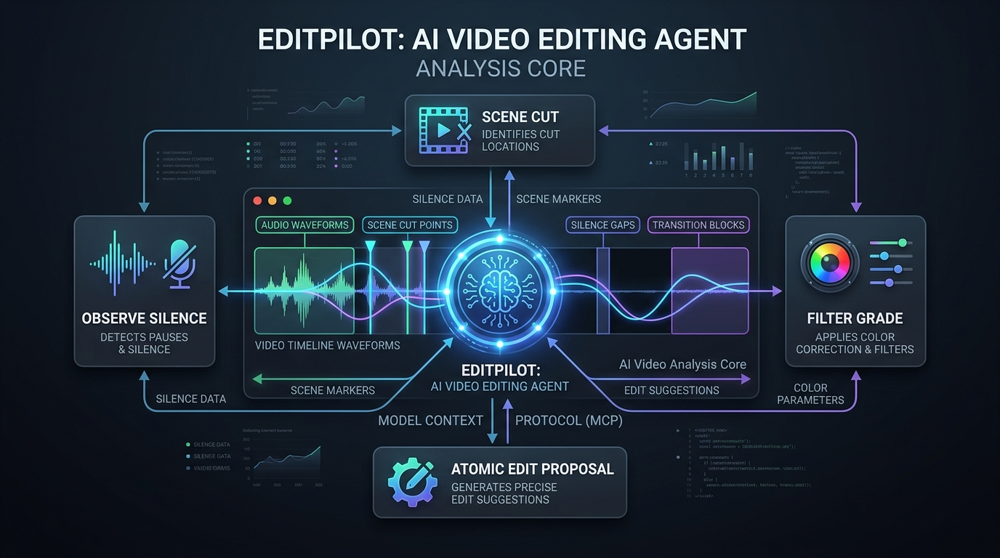
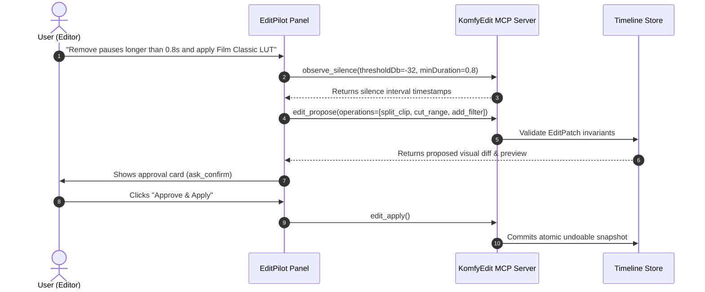

# EditPilot AI Assistant

  

**EditPilot** is KomfyEdit's built-in, locally-controlled AI editing companion. It allows advanced LLM agents (such as Claude Code, Antigravity, or OpenAI Codex) to observe your timeline, calculate acoustic silences and visual scene changes, propose atomic edits, and execute them safely with human oversight.

---

## 🤖 1. The Model Context Protocol (MCP) Approach

Traditional video editor plugins often lack safety boundaries or produce non-reproducible edits. KomfyEdit isolates AI capabilities behind an offline **MCP Server** (`packages/komfyedit-mcp/`):

---

## 🛡️ 2. Core Safety Invariants & Live UI Sync

EditPilot guarantees that no model can ever corrupt or destructively wipe your timeline:

1. **Single-Writer Safety Lock**:
   - Eliminates write collisions between the app's debounced autosave and external AI agents. Write ownership is managed strictly to prevent accidental data loss.
2. **Live In-Memory UI Synchronization**:
   - Instead of modifying JSON project files on disk and requiring a manual reload, the KomfyEdit MCP server dispatches `edit_apply` mutations directly into the running app store over IPC. You see **timeline clips update in real time** right before your eyes!
3. **Human-in-the-Loop (`ask_confirm`)**: Destructive or sequence-altering operations require user review and explicit confirmation before commit.
4. **Locked Track Enforcement**: Any track with the lock toggle engaged (`🔒`) rejects automated modifications.
5. **Strict Invariant Checking (`qc_check`)**:
   - Zero micro-clips (prevents fragments smaller than 0.5s).
   - Main story contiguity (checks for accidental gaps on track V1).
   - Boundary checks (ensures clip start times never exceed media boundaries).
6. **Instant Atomic Snapshot Undo (`edit_undo` / `Ctrl + Z`)**: Every patch applied by EditPilot is bundled into an atomic batch that can be reverted with a single `Ctrl + Z`.

---

## 🚀 3. Powerful AI Automation Workflows

### 1. Automatic Silence Removal (Smart Jump-Cutting)
> *"Remove all silences and pauses longer than 0.7 seconds from Track V1."*
- EditPilot runs `observe_silence` to analyze the audio waveform and generates ripple cut operations to tighten the sequence.

### 2. Scene Cut Detection
> *"Detect scene transitions across the raw video and slice at each camera switch."*
- EditPilot executes `observe_scenes`, identifies cut boundaries based on frame luminance shifts, and slices cleanly at every scene change.

### 3. Auto Highlight Extraction
> *"Extract a 30-second high-energy highlight reel from this sports event footage for a vertical teaser."*
- EditPilot triggers `extract_highlights`: evaluating audio energy peaks, voice dynamics, motion velocity, and visual cuts to isolate the most engaging moments.

### 4. Contextual B-Roll Copilot
> *"Review the speech transcript and suggest relevant B-Roll clips from the media bin to overlay on Track V2."*
- EditPilot uses `suggest_broll` paired with transcript cues to place contextual cutaways exactly where the speaker references them.

### 5. Offline Speech-to-Text Subtitles (Whisper)
> *"Transcribe the dialogue across the sequence and generate a synchronized subtitle track."*
- EditPilot calls `transcribe` to run the embedded local Whisper model and creates word-aligned subtitle cues directly on the timeline.

### 6. Automated Filters & Sticker Styling
> *"List available color filters and apply a warm Cinematic LUT to the timeline."*
- EditPilot inspects `filter_list` and `sticker_list` to enrich your timeline visuals automatically according to your prompt.

---

## 📖 4. MCP Tools Reference (22 Tools)

The local KomfyEdit MCP server exposes 22 standard tools to external AI agents:

| Category | MCP Tool Name | Description & Purpose |
|---|---|---|
| **Read** | `project_list` | Lists all local KomfyEdit projects. |
| | `project_open` | Opens a project workspace by its unique ID. |
| | `timeline_describe` | Detailed breakdown of tracks, clips, effects, filters, and subtitles. |
| | `timeline_summary` | High-level summary of duration, clip counts, and track layout. |
| | `subtitle_list` | Retrieves all subtitle items and timestamp ranges. |
| | `media_list` | Lists all media assets available in the current project. |
| | `media_probe` | Probes media technical specs (dimensions, codec, framerate, audio channels). |
| **Measure** | `observe_silence` | Identifies quiet/silent intervals based on dB threshold and minimum duration. |
| | `observe_scenes` | Detects visual shot changes and hard scene transitions. |
| | `observe_loudness` | Measures integrated audio loudness and true peak standards (LUFS). |
| | `observe_filmstrip` | Extracts thumbnail filmstrips allowing multimodal AI models to inspect visual frames. |
| **AI Intelligence** | `transcribe` | Transcribes audio speech to synchronized captions with local Whisper. |
| | `extract_highlights` | Detects high-energy emotional and exciting moments across footage. |
| | `suggest_broll` | Suggests contextual B-Roll insertions matching dialogue topics. |
| | `qc_check` | Audits timeline health (unsupported overlaps, locked track breaches, missing assets). |
| **Assets** | `filter_list` | Lists all 3D LUT presets available in the library. |
| | `sticker_list` | Enumerates decorative stickers and animated emojis. |
| **Interaction** | `ask_confirm` | Renders an interactive confirmation card with visual diff for user approval. |
| **Edit & Undo** | `edit_propose` | Proposes a structured `EditPatch` and generates human-readable diff descriptions. |
| | `edit_apply` | Commits approved edits directly into the active in-memory timeline. |
| | `edit_undo` | Reverts the last applied edit patch. |
| **Preview** | `render_preview` | Renders a fast visual video slice for agent and user preview verification. |
| | `render_cancel` | Cancels an ongoing preview render job. |

---

[← Previous: 06. Export & Delivery](06-export-and-delivery.md) · [Back to Documentation Hub →](../README.md)
