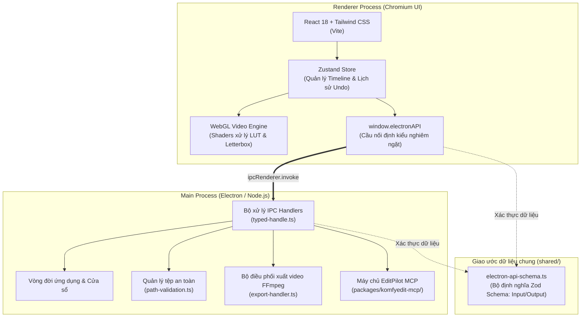

# Tổng quan kiến trúc hệ thống

KomfyEdit được thiết kế theo mô hình 2 tầng tách biệt rõ ràng, tối ưu cho hiệu năng đồ họa thời gian thực, tính ổn định ngoại tuyến (offline) và an toàn tuyệt đối qua cầu nối IPC.

---

## 🏛️ Sơ đồ kiến trúc tổng thể



---

## 🔑 Các trụ cột thiết kế cốt lõi

### 1. Hai tầng độc lập, không có Backend đám mây
KomfyEdit hoàn toàn không chứa mã kết nối API máy chủ bên ngoài, không có hệ thống đăng ký tài khoản hay theo dõi dữ liệu người dùng. Toàn bộ project, cache hình ảnh thu nhỏ (thumbnails) và biểu đồ sóng âm (waveforms) đều nằm trực tiếp trên ổ cứng người dùng.

### 2. Giao tiếp IPC định kiểu chặt chẽ với Zod
Mọi hàm gọi giữa giao diện React và tiến trình Electron đều được quản lý tại `shared/electron-api-schema.ts`. Mỗi phương thức IPC bắt buộc phải có cặp Zod schema kiểm tra đầu vào và đầu ra:
```ts
// shared/electron-api-schema.ts
export const electronAPISchemas = {
  getAssetMetadata: {
    input: z.object({ filePath: z.string() }),
    output: z.object({ width: z.number(), height: z.number(), duration: z.number() }),
  },
  // ...
}
```
Cơ chế này ngăn chặn hoàn toàn lỗi sai kiểu dữ liệu lúc runtime và cung cấp khả năng tự động gợi ý code (IntelliSense) hoàn hảo cho TypeScript.

### 3. Kiểm soát đường dẫn tệp an toàn (Path Traversal Protection)
Tất cả các đường dẫn tệp do phía giao diện gửi xuống đều bắt buộc phải chạy qua module kiểm tra `electron/path-validation.ts` để chắc chắn thao tác đọc/ghi chỉ diễn ra trong thư mục hợp lệ của dự án.

### 4. Tích hợp sẵn FFmpeg độc lập
Phần mềm đóng gói sẵn tệp nhị phân `ffmpeg-static`. Khi biên dịch đóng gói sản phẩm, Electron sẽ tự động trỏ đến đường dẫn thư mục `app.asar.unpacked`. Nếu vì lý do nào đó tệp đóng gói bị thiếu, hệ thống sẽ tự động tìm kiếm lệnh `ffmpeg` có sẵn trong biến môi trường `PATH` của hệ điều hành.

---

[Tiếp theo: 02. Thiết lập môi trường phát triển →](02-setup-and-workflow.md)
