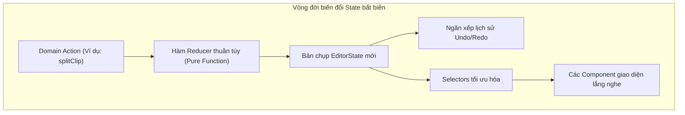

# Quản lý State & Editor Store

Một phần mềm biên tập video đòi hỏi phản hồi thao tác dưới 1 miligiây, bám sát từng khung hình của đầu đọc playhead ở tần số 60Hz và khả năng hoàn tác (Undo/Redo) tin cậy tuyệt đối. KomfyEdit hiện thực hóa điều này bằng cấu trúc **Zustand store** tách biệt logic nghiêm ngặt.

---

## 🏗️ Cấu trúc thư mục Store

Toàn bộ logic trạng thái của trình biên tập nằm trong `frontend/views/editor/` và `core/`:

```
frontend/views/editor/
├── editor-store.tsx        # Khởi tạo Zustand store & React Provider
├── editor-state.ts         # Định nghĩa cấu trúc kiểu EditorState & giá trị mặc định
├── editor-selectors.ts     # Các hàm truy vấn dữ liệu thuần túy (memoized selectors)
└── editor-actions.ts       # Các hàm biến đổi state bất biến (pure actions)
```



---

## ⚡ Các quy tắc vàng khi lập trình State

### 1. Tất cả Actions phải là hàm thuần túy (Pure Functions)
Mọi hàm thay đổi dữ liệu phải nhận vào `(state: EditorState, ...args)` và trả về một đối tượng `EditorState` mới hoàn toàn bất biến. Tuyệt đối không thay đổi trực tiếp (mutate) thuộc tính của state hiện tại:

```ts
// ĐÚNG: Trả về state mới với tính bất biến
export function updateClipPosition(state: EditorState, clipId: string, newStart: number): EditorState {
  return updateActiveTimeline(state, timeline => ({
    ...timeline,
    clips: timeline.clips.map(clip => 
      clip.id === clipId ? { ...clip, startTime: newStart } : clip
    )
  }))
}

// SAI NGUY HIỂM: Gán đè trực tiếp lên state!
export function badMutation(state: EditorState, clipId: string) {
  state.editorModel.timelines[0].clips[0].startTime = 5 // TUYỆT ĐỐI KHÔNG LÀM THẾ NÀY!
}
```

### 2. Tối ưu hóa đường đi nóng (Hot Path Optimization)
Đầu đọc Playhead di chuyển liên tục ở tần số 60Hz. Để tránh hiện tượng giật lag khung hình do React re-render:
- Không bao giờ khởi tạo đối tượng hoặc mảng mới bên trong hàm selector nếu không được memoize.
- Giữ xung nhịp playback độc lập với các component giao diện nặng.
- Sử dụng `React.memo` và `useCallback` cho các phần tử clip và track trên timeline.

### 3. Cơ chế Snapshot Undo/Redo
Ngăn xếp lịch sử sẽ tự động lưu lại các bản chụp trạng thái của timeline. Khi thực hiện một chuỗi thao tác phức tạp (ví dụ: AI cắt lọc hàng loạt khoảng lặng), hãy gom toàn bộ các lát cắt vào một đợt cập nhật duy nhất (batch snapshot) để người dùng có thể hoàn tác toàn bộ chỉ bằng một lần bấm `Ctrl + Z`.

---

[← Quay lại: 02. Cài đặt môi trường](02-setup-and-workflow.md) · [Tiếp theo: 04. Máy chủ MCP & Kỹ năng AI →](04-mcp-server-and-skills.md)
