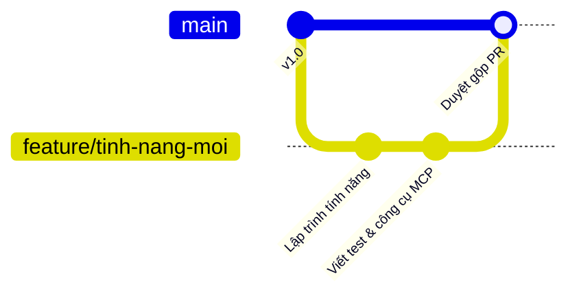

# Hướng dẫn đóng góp mã nguồn (Contributing)

Cảm ơn bạn đã quan tâm và muốn chung tay phát triển **KomfyEdit**! Chúng tôi hướng tới mục tiêu xây dựng một phần mềm dựng phim nguồn mở, chạy offline tốc độ cao và tôn trọng quyền riêng tư người dùng.

---

## 🌟 Quy tắc ứng xử chung (Code of Conduct)

Chúng tôi cam kết duy trì một môi trường cộng đồng văn minh, thân thiện và tôn trọng lẫn nhau. Hãy luôn lắng nghe, chia sẻ kiến thức với tinh thần cầu thị và lịch sự trong mọi bình luận, thảo luận issue cũng như review mã nguồn.

---

## 📋 Các hình thức đóng góp

1. **Báo cáo lỗi (Report Bugs)**: Mở Issue mô tả chi tiết các bước tái hiện lỗi kèm thông tin hệ điều hành.
2. **Cải thiện tài liệu**: Sửa lỗi chính tả, bổ sung các bài hướng dẫn sử dụng, hoàn thiện bản dịch.
3. **Đóng góp tính năng & Sửa lỗi**: Tạo nhánh mới và gửi Pull Request (PR) về nhánh `main`.
4. **Phát triển kỹ năng AI**: Viết thêm các kịch bản kiểm thử (evaluation scenarios) hoặc công cụ MCP mới trong `packages/komfyedit-mcp/`.

---

## 🚀 Quy trình gửi Pull Request (PR)



1. **Fork repository** này về tài khoản GitHub cá nhân của bạn.
2. **Tạo nhánh làm việc mới**:
   ```bash
   git checkout -b feature/ten-tinh-nang-moi
   ```
3. **Tuân thủ quy chuẩn mã nguồn**:
   - Sử dụng TypeScript nghiêm ngặt, không dùng kiểu `any`.
   - Giữ nguyên tắc hàm thuần túy bất biến trong các action của store.
4. **Chạy các bước kiểm tra bắt buộc trước khi commit**:
   ```bash
   # 1. Kiểm tra kiểu dữ liệu TypeScript
   pnpm typecheck

   # 2. Kiểm tra biên dịch giao diện Frontend
   pnpm build:frontend

   # 3. Nếu sửa đổi các công cụ AI, chạy kiểm thử kỹ năng
   pnpm eval:skills
   ```
5. **Đặt thông điệp Commit theo chuẩn Conventional Commits**:
   - `feat: bổ sung phím tắt roll trim`
   - `fix: sửa lỗi dồn timeline khi xóa clip`
   - `docs: bổ sung hình ảnh minh họa cho Adjustment Layer`
6. **Mở Pull Request**: Điền mô tả rõ ràng mục đích thay đổi, đính kèm ảnh chụp màn hình hoặc ảnh động GIF nếu có thay đổi về giao diện người dùng.

---

## 💬 Trao đổi trước khi thực hiện thay đổi lớn

Nếu bạn có kế hoạch thực hiện một thay đổi lớn về kiến trúc hoặc cấu trúc lại giao diện, hãy mở một Issue thảo luận trước với đội ngũ quản trị (maintainers). Việc này giúp đồng nhất định hướng phát triển lâu dài và tránh lãng phí thời gian công sức của bạn!

---

[← Quay lại: 04. Máy chủ MCP & Kỹ năng AI](04-mcp-server-and-skills.md) · [Về trang chủ tài liệu →](../README.md)
