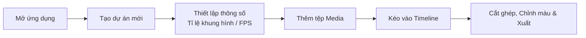

# Bắt đầu với KomfyEdit

<p align="center">
  
</p>

**KomfyEdit** là ứng dụng biên tập video phi tuyến tính (non-linear video editor) nguồn mở dành cho máy tính để bàn (desktop). Ứng dụng hoạt động hoàn toàn **offline 100%**, đảm bảo quyền riêng tư tuyệt đối, tốc độ xử lý cao và không yêu cầu tài khoản đám mây hay máy chủ bên ngoài.

---

## 💻 Yêu cầu hệ thống

| Thành phần | Mức tối thiểu | Mức đề nghị |
|---|---|---|
| **Hệ điều hành** | Windows 10/11 (64-bit), macOS 12+ (Intel / Apple Silicon), Ubuntu 20.04+ | Windows 11, macOS 14+ (M1/M2/M3), Ubuntu 22.04+ |
| **Vi xử lý (CPU)** | 4 nhân x86 64-bit hoặc ARM64 | 8 nhân đời mới |
| **Bộ nhớ RAM** | 8 GB | 16 GB trở lên |
| **Ổ cứng** | Trống tối thiểu 2 GB (chưa tính dung lượng chứa video) | Ổ cứng SSD NVMe tốc độ cao |
| **Màn hình** | 1280 × 720 pixel | 1920 × 1080 pixel trở lên |

---

## 📥 Tải về & Cài đặt

### Cách 1: Sử dụng bản cài đặt phát hành sẵn (Khuyên dùng)

Tải bản dựng phù hợp với máy của bạn tại trang [GitHub Releases](https://github.com/tuyenhm68/KomfyEdit/releases):

| Hệ điều hành | Tệp cần tải |
|---|---|
| Windows 10/11 (64-bit) | `KomfyEdit-<phiên bản>-win-x64-Setup.exe` |
| macOS chip Apple (M1–M4) | `KomfyEdit-<phiên bản>-mac-arm64.dmg` |
| macOS chip Intel | `KomfyEdit-<phiên bản>-mac-x64.dmg` |
| Linux (64-bit) | `KomfyEdit-<phiên bản>-linux-x86_64.AppImage` hoặc `KomfyEdit-<phiên bản>-linux-amd64.deb` |
| Linux (ARM) | `KomfyEdit-<phiên bản>-linux-arm64.AppImage` hoặc `KomfyEdit-<phiên bản>-linux-arm64.deb` |

> **KomfyEdit chưa được ký số.** Chứng chỉ ký số tốn phí mà dự án chưa có, nên mọi hệ điều hành đều cảnh báo "nhà phát triển không xác định" ở lần mở đầu tiên. Cách vượt qua nằm ngay bên dưới, chỉ phải làm **một lần cho mỗi lần cài**.

#### Windows

Chạy file cài đặt. SmartScreen sẽ hiện *"Windows protected your PC"*: bấm **More info**, rồi bấm **Run anyway**. Từ lần sau app mở bình thường.

#### macOS

Mở file `.dmg` rồi kéo KomfyEdit vào thư mục **Applications**. Lần mở đầu tiên macOS sẽ từ chối, thường kèm dòng *"KomfyEdit is damaged and can't be opened. You should move it to the Trash."*

**Ứng dụng không hề bị hỏng.** Đó chỉ là thông báo macOS dành cho app tải về mà chưa có chữ ký được Apple công chứng. Để xử lý, mở **Terminal** và chạy:

```bash
xattr -dr com.apple.quarantine /Applications/KomfyEdit.app
```

Sau đó mở app như bình thường.

Lệnh này gỡ cờ `com.apple.quarantine` mà macOS gắn vào mọi thứ tải qua trình duyệt. Nó **không** tắt Gatekeeper, **không** đổi thiết lập hệ thống nào, và chỉ tác động đến đúng ứng dụng này.

Nếu bạn không muốn dùng Terminal: bấm đúp vào app cho nó bị chặn, rồi vào **System Settings → Privacy & Security**, kéo xuống mục Security và bấm **Open Anyway** ở dòng nhắc về KomfyEdit. Từ macOS 15 Sequoia trở đi đây là cách duy nhất qua giao diện, vì Apple đã bỏ thao tác chuột phải → Open cho app chưa ký.

> **Tự động cập nhật không hoạt động trên macOS khi app chưa ký.** `electron-updater` từ chối cài bản cập nhật không có chữ ký hợp lệ, nên trên macOS bạn phải tự tải file `.dmg` mới mỗi lần. Windows và Linux vẫn tự cập nhật bình thường.

#### Linux

**AppImage** — cấp quyền chạy rồi khởi động:

```bash
chmod +x KomfyEdit-*-linux-x86_64.AppImage
./KomfyEdit-*-linux-x86_64.AppImage
```

**Debian / Ubuntu** — cài bằng `apt` để nó tự xử lý các gói phụ thuộc còn thiếu:

```bash
sudo apt install ./KomfyEdit-*-linux-amd64.deb
```

### Cách 2: Khởi chạy từ mã nguồn (Dành cho lập trình viên)

1. **Chuẩn bị môi trường**:
   - Cài đặt [Node.js](https://nodejs.org/) (phiên bản 20 LTS trở lên).
   - Cài đặt trình quản lý gói [pnpm](https://pnpm.io/): `npm install -g pnpm`.
   - Cài đặt [Git](https://git-scm.com/).

2. **Tải mã nguồn (Clone repository)**:
   ```bash
   git clone https://github.com/tuyenhm68/KomfyEdit.git komfyedit
   cd komfyedit
   ```

3. **Cài đặt các gói phụ thuộc**:
   ```bash
   pnpm install
   ```

4. **Khởi chạy ứng dụng ở chế độ phát triển**:
   ```bash
   pnpm dev
   ```

---

## 🚀 Tạo dự án đầu tiên của bạn



1. **Mở KomfyEdit**: Màn hình Home sẽ xuất hiện hiển thị danh sách các dự án gần đây.
2. **Bấm "New Project" (Dự án mới)**:
   - Đặt tên cho dự án (ví dụ: `Vlog Du Lịch Đà Lạt`).
   - Chọn tỉ lệ khung hình (Aspect Ratio):
     - `16:9` (1920×1080 hoặc 4K) cho YouTube và TV.
     - `9:16` (1080×1920) cho TikTok, Reels, Shorts.
     - `1:1` (1080×1080) cho bài đăng Instagram.
   - Chọn tốc độ khung hình (ví dụ: `24 fps`, `30 fps`, hoặc `60 fps`).
3. **Thêm tệp Media**:
   - Nhấn nút **`+ Import`** ở khay tài nguyên góc trên bên trái hoặc kéo thả trực tiếp các video, bài hát, hình ảnh từ máy tính vào cửa sổ ứng dụng.
4. **Đưa lên Timeline**:
   - Kéo clip từ khay Media thả xuống track `V1` (Video) hoặc `A1` (Audio) trên timeline.
   - Nhấn phím `Space` để phát hoặc dừng video.

---

[Tiếp theo: 02. Giao diện & Không gian làm việc →](02-interface-and-workspace.md)
