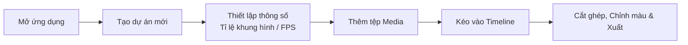

# Bắt đầu với KomfyEdit

<p align="center">
  
</p>

**KomfyEdit** là ứng dụng biên tập video phi tuyến tính (non-linear video editor) nguồn mở dành cho máy tính để bàn (desktop). Ứng dụng hoạt động hoàn toàn **offline 100%**, đảm bảo quyền riêng tư tuyệt đối, tốc độ xử lý cao và không yêu cầu tài khoản đám mây hay máy chủ bên ngoài.

---

## 💻 Yêu cầu hệ thống

| Thành phần | Mức tối thiểu | Mức đề nghị |
|---|---|---|
| **Hệ điều hành** | Windows 10/11 (64-bit), macOS 12+ (Intel / Apple Silicon), Ubuntu 20.04+ | Windows 11, macOS 14+ (M1/M2/M3), Ubuntu 22.04+ |
| **Vi xử lý (CPU)** | 4 nhân x86 64-bit hoặc ARM64 | 8 nhân đời mới |
| **Bộ nhớ RAM** | 8 GB | 16 GB trở lên |
| **Ổ cứng** | Trống tối thiểu 2 GB (chưa tính dung lượng chứa video) | Ổ cứng SSD NVMe tốc độ cao |
| **Màn hình** | 1280 × 720 pixel | 1920 × 1080 pixel trở lên |

---

## 📥 Tải về & Cài đặt

### Cách 1: Sử dụng bản cài đặt phát hành sẵn (Khuyên dùng)
Tải về bản phát hành mới nhất phù hợp với hệ điều hành của bạn từ mục [GitHub Releases](https://github.com/Lightricks/LTX-Desktop/releases):
- **Windows**: Tải file `KomfyEdit-Setup-x.x.x.exe` và chạy cài đặt.
- **macOS**: Tải file `KomfyEdit-x.x.x.dmg` hoặc `KomfyEdit-x.x.x-mac.zip`.
- **Linux**: Tải file `KomfyEdit-x.x.x.AppImage` hoặc `.deb`.

### Cách 2: Khởi chạy từ mã nguồn (Dành cho lập trình viên)

1. **Chuẩn bị môi trường**:
   - Cài đặt [Node.js](https://nodejs.org/) (phiên bản 20 LTS trở lên).
   - Cài đặt trình quản lý gói [pnpm](https://pnpm.io/): `npm install -g pnpm`.
   - Cài đặt [Git](https://git-scm.com/).

2. **Tải mã nguồn (Clone repository)**:
   ```bash
   git clone https://github.com/Lightricks/LTX-Desktop.git komfyedit
   cd komfyedit
   ```

3. **Cài đặt các gói phụ thuộc**:
   ```bash
   pnpm install
   ```

4. **Khởi chạy ứng dụng ở chế độ phát triển**:
   ```bash
   pnpm dev
   ```

---

## 🚀 Tạo dự án đầu tiên của bạn



1. **Mở KomfyEdit**: Màn hình Home sẽ xuất hiện hiển thị danh sách các dự án gần đây.
2. **Bấm "New Project" (Dự án mới)**:
   - Đặt tên cho dự án (ví dụ: `Vlog Du Lịch Đà Lạt`).
   - Chọn tỉ lệ khung hình (Aspect Ratio):
     - `16:9` (1920×1080 hoặc 4K) cho YouTube và TV.
     - `9:16` (1080×1920) cho TikTok, Reels, Shorts.
     - `1:1` (1080×1080) cho bài đăng Instagram.
   - Chọn tốc độ khung hình (ví dụ: `24 fps`, `30 fps`, hoặc `60 fps`).
3. **Thêm tệp Media**:
   - Nhấn nút **`+ Import`** ở khay tài nguyên góc trên bên trái hoặc kéo thả trực tiếp các video, bài hát, hình ảnh từ máy tính vào cửa sổ ứng dụng.
4. **Đưa lên Timeline**:
   - Kéo clip từ khay Media thả xuống track `V1` (Video) hoặc `A1` (Audio) trên timeline.
   - Nhấn phím `Space` để phát hoặc dừng video.

---

[Tiếp theo: 02. Giao diện & Không gian làm việc →](02-interface-and-workspace.md)
