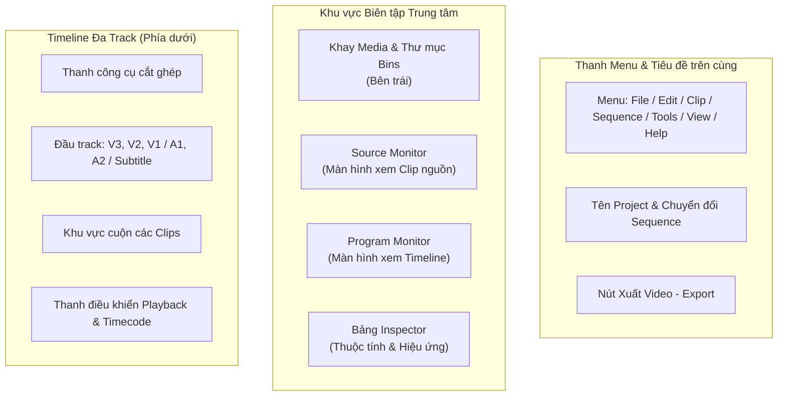

# Giao diện & Không gian làm việc

  

Giao diện làm việc của KomfyEdit được thiết kế khoa học theo chuẩn các phần mềm dựng phim chuyên nghiệp, chia thành các khu vực trực quan giúp bạn biên tập nhanh chóng.

---

## 🎛️ Bố cục các khu vực chính

---

## 1. Khay tài nguyên Media (Asset Browser)
Nằm ở góc trên bên trái màn hình:
- **Bộ lọc nhanh**: Lọc file theo **All** (Tất cả), **Video**, **Image** (Hình ảnh), **Audio** (Âm thanh).
- **Quản lý Thư mục (Bins)**: Bấm nút `+ Bin` để tạo các thư mục phân loại như *Cảnh chính*, *B-Roll*, *Nhạc nền*, *Voiceover*.
- **Gắn nhãn màu (Color Labels)**: Nhấp chuột phải vào bất kỳ asset nào để gắn nhãn màu giúp nhận diện nhanh trên timeline.
- **Rê chuột xem trước (Hover Scrub)**: Rê chuột ngang qua thumbnail video để xem nhanh nội dung từng khung hình mà không cần mở file.

---

## 2. Hệ thống màn hình Monitor kép

### Source Monitor (Clip Viewer - Xem trước Clip nguồn)
Nhấp đúp chuột vào bất kỳ clip nào trong khay Media để mở trong Source Monitor:
- Đặt điểm bắt đầu **In Point** (`I`) và điểm kết thúc **Out Point** (`O`) để lấy đúng đoạn cần thiết.
- Chèn vào Timeline bằng phím dấu phẩy `,` (Insert) hoặc phím dấu chấm `.` (Overwrite).
- Xóa đánh dấu In/Out bằng tổ hợp phím `Alt + X`.

### Program Monitor (Timeline Viewer - Xem kết quả Timeline)
Hiển thị chính xác khung hình tại vị trí đầu đọc (playhead) trên Timeline:
- **Phím con thoi J-K-L**:
  - `J`: Tua lùi (bấm nhiều lần để tăng tốc 2x, 4x, 8x)
  - `K`: Tạm dừng (Pause)
  - `L`: Tua tới (bấm nhiều lần để tăng tốc 2x, 4x, 8x)
- **Nhảy từng khung hình**: Nhấn phím mũi tên `Trái` / `Phải`; nhấn `Shift + Trái/Phải` để nhảy 1 giây.
- **Chế độ giảm tải xem trước (Resolution)**: Chuyển đổi giữa `Full`, `1/2`, hoặc `1/4` để máy tính cấu hình nhẹ vẫn phát mượt mà 60fps khi timeline có nhiều lớp hiệu ứng.

---

## 3. Bảng Inspector (Bảng thuộc tính bên phải)
Khi chọn một clip trên timeline, bảng Inspector sẽ xuất hiện các nhóm tinh chỉnh:
- **Transform**: Tọa độ X/Y, phóng to/thu nhỏ (Scale), xoay (Rotation), độ mờ đục (Opacity), tích hợp nút gắn **Keyframe hình thoi** để tạo hoạt ảnh chuyển động mượt mà.
- **Chỉnh màu (Color Grading)**: Độ phơi sáng (Exposure), độ sáng (Brightness), độ tương phản (Contrast), vùng sáng (Highlights), vùng tối (Shadows), nhiệt độ màu (Temperature), sắc thái (Tint), độ bão hòa (Saturation).
- **Âm thanh**: Thanh kéo âm lượng (-60dB đến +12dB), nút Mute, Audio Boost (+24dB), Audio Limiter chống vỡ tiếng và Audio Ducking tự động giảm nhạc nền khi có tiếng nói.
- **Tốc độ (Speed)**: Tua nhanh/chậm từ 0.1x đến 10x, đảo ngược chiều video (Reverse).
- **Chế độ hòa trộn (Blend Modes)**: Normal, Screen, Multiply, Overlay, Soft Light... khi xếp chồng các layer.
- **Hiệu ứng Adjustment Layer**: Tùy chỉnh bộ lọc 3D LUT và tỷ lệ Letterbox khung viền điện ảnh.

---

## 4. Bảng Thư viện Đa năng (Editor Library Panel)
Nằm ở bảng điều khiển bên trái, cho phép chuyển đổi linh hoạt giữa các nhóm tài nguyên sáng tạo:
- **Media**: Quản lý video, âm thanh, hình ảnh và Adjustment Layer trong dự án.
- **Bộ lọc (Filters)**: Thư viện hàng chục bộ lọc màu 3D LUT phân loại theo chủ đề (Featured, Cinematic, Retro, Mood, Portrait, B&W...), có thanh tìm kiếm, mục Yêu thích (Favorites), thanh chỉnh cường độ (Intensity) và tính năng "Áp dụng cho tất cả".
- **Chuyển cảnh (Transitions)**: Kho hiệu ứng chuyển cảnh trực quan (Cross Dissolve, Dip to Black/White, Wipe, Slide, Zoom, Push...), hỗ trợ kéo thả trực tiếp vào điểm nối giữa 2 clip.
- **Nhãn dán (Stickers)**: Thư viện sticker đồ họa, biểu tượng cảm xúc (emojis), huy hiệu, mũi tên chỉ dẫn hỗ trợ kéo thả lên timeline làm lớp phủ trang trí.
- **Văn bản & Tiêu đề (Text Presets)**: Các mẫu chữ tiêu đề, phụ đề thiết kế sẵn với hiệu ứng viền (stroke), đổ bóng và hộp nền bắt mắt.

---

## 5. Cài đặt Ứng dụng & Cài đặt Dự án (Settings)

### Cài đặt Ứng dụng (App Preferences - `Ctrl + ,` / `Cmd + ,`)
Mở menu `Edit` → `Preferences` hoặc nhấn biểu tượng bánh răng cài đặt ở thanh tiêu đề:
- **Ngôn ngữ giao diện (Language)**: Chuyển đổi linh hoạt giữa **Tiếng Việt** và **English**.
- **Tăng tốc phần cứng (Hardware Acceleration)**: Tự động nhận diện và tận dụng GPU để giải mã và render video tốc độ cao (hỗ trợ NVIDIA NVENC, Intel QuickSync, Apple VideoToolbox).
- **Cấu hình Proxy & Render Cache**: Thiết lập thư mục lưu trữ các tệp dựng phim nhẹ (Proxy) và bộ nhớ đệm hiệu ứng (Render Cache), kèm nút dọn dẹp giải phóng dung lượng ổ đĩa.
- **Cấu hình Trợ lý AI EditPilot**: Thiết lập công cụ CLI Agent mặc định (Claude Code, Antigravity, hoặc Codex) cùng danh sách quyền hạn thực thi.

### Cài đặt Dự án (Project Settings)
Mở menu `File` → `Project Settings...`:
- Cho phép thay đổi độ phân giải khung hình (Canvas Size) từ 1080p sang 4K UHD hoặc tỉ lệ dọc 9:16 (TikTok/Reels).
- Điều chỉnh tốc độ khung hình chuẩn (24 fps điện ảnh, 30 fps tiêu chuẩn, 60 fps thể thao/gameplay).
- Xem bảng chi tiết thông tin dự án (Project Details): tổng dung lượng media, số lượng clip, phiên bản định dạng lưu trữ file JSON.

---

[← Quay lại: 01. Bắt đầu](01-getting-started.md) · [Tiếp theo: 03. Timeline & Công cụ cắt ghép →](03-timeline-and-editing.md)
