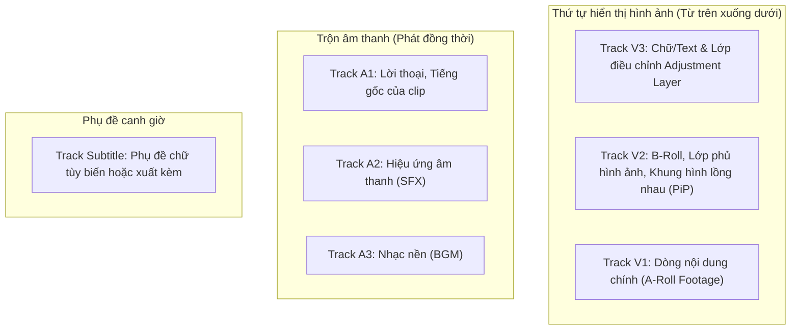

# Timeline & Công cụ cắt ghép

<p align="center">
  
</p>

Timeline đa tầng (multi-track) là trái tim của KomfyEdit. Ứng dụng hỗ trợ xếp chồng linh hoạt các lớp Video, Audio, Adjustment Layer và Phụ đề với đầy đủ các công cụ dựng phim tiêu chuẩn.

---

## 🛠️ Bộ công cụ cắt ghép (Editing Tools)

Nằm trên thanh công cụ dọc bên trái Timeline:

| Công cụ | Phím tắt | Biểu tượng | Mô tả chức năng |
|---|---|:---:|---|
| **Công cụ chọn (Select)** | `V` | ↖ | Chọn, di chuyển và kéo mép clip bình thường mà không làm ảnh hưởng các clip xung quanh. |
| **Dao lam / Cắt (Blade)** | `C` | ✂ | Cắt đứt clip tại vị trí con trỏ chuột hoặc cắt tại playhead. |
| **Kéo dồn (Ripple Edit)** | `B` | ↔ | Cắt ngắn hoặc kéo dài mép clip, đồng thời tự động dồn toàn bộ các clip phía sau lại gần hoặc đẩy ra xa. |
| **Cuộn điểm nối (Roll Edit)** | `N` | ⧎ | Di chuyển điểm cắt giữa 2 clip liền kề nhau mà không làm thay đổi tổng độ dài của timeline. |
| **Trượt nội dung (Slip)** | `Y` | ⇥ | Thay đổi đoạn trích bên trong clip mà giữ nguyên vị trí và độ dài của nó trên timeline. |
| **Trượt vị trí (Slide)** | `U` | ⇄ | Di chuyển một clip sang trái/phải kẹp giữa 2 clip hàng xóm, tự động thu ngắn clip trước và kéo dài clip sau. |
| **Bật/Tắt Hít nam châm (Snap)** | `S` | 🧲 | Bật hít dính các mép clip vào đầu đọc playhead hoặc mép clip liền kề. |

---

## 🎞️ Cấu trúc tầng Track



### Điều khiển đầu Track (Track Headers)
Mỗi đầu track đều có các nút điều khiển tiện ích:
- **Khóa track (`🔒`)**: Bảo vệ track không bị cắt nhầm hay di chuyển ngoài ý muốn.
- **Tắt tiếng (`M`)**: Tắt âm thanh của track khi phát và khi xuất video.
- **Nghe đơn lẻ (`S` - Solo)**: Chỉ nghe riêng track âm thanh này, tạm tắt các track khác.
- **Ẩn hình ảnh (`👁`)**: Tạm thời ẩn hình ảnh của track video khỏi màn hình xem trước và khi render.
- **Các nút tạo nhanh**:
  - `+ V`: Thêm một track video mới lên trên cùng.
  - `+ A`: Thêm một track audio mới xuống dưới cùng.
  - `Subs`: Tạo track phụ đề chuyên dụng.
  - **`Adj`**: Tạo một **Lớp điều chỉnh (Adjustment Layer)** vào khay Media để sẵn sàng kéo vào timeline.

---

## ⚡ Thao tác xử lý khoảng trống (Gap Actions Popover)

Khi có khoảng trống giữa các clip trên Timeline, bạn có thể tương tác trực tiếp thông qua **Gap Actions Popover**:
- **Nhấp chuột trái / phải vào khoảng trống**: Một menu thao tác nhanh sẽ xuất hiện ngay tại khoảng trống:
  - **Đóng khoảng trống (Close Gap / Ripple Delete)**: Thu hẹp khoảng trống và dồn toàn bộ các clip phía sau về phía trước (`Shift + Delete`).
  - **Chèn màu / Lớp điều chỉnh (Insert Color / Adjustment Layer)**: Tạo ngay một phân đoạn màu nền hoặc Adjustment Layer vừa khít đúng kích thước khoảng trống mà không cần căn chỉnh thủ công.
- **Liên kết hình - tiếng (Linked Selection)**: Video và Audio đi kèm được gắn kết đồng bộ với nhau. Giữ phím `Alt` khi thao tác nếu bạn muốn di chuyển hoặc cắt riêng lẻ hình ảnh hoặc âm thanh.
- **Cắt tại đầu đọc (Split at Playhead)**: Nhấn tổ hợp phím `Ctrl + K` (Windows/Linux) hoặc `Cmd + K` (macOS) để cắt đôi tất cả các clip đang mở khóa ngay tại vị trí con trỏ đỏ.

---

## 💎 Hoạt ảnh chuyển động với Keyframe (Keyframing)

KomfyEdit hỗ trợ hệ thống **Keyframe chuyên nghiệp** giúp tạo hoạt ảnh chuyển động mượt mà cho bất kỳ thuộc tính nào:

```mermaid
flowchart LR
    KF1["Keyframe 1<br>(Scale: 100%, X: 0)"] -->|Nội suy mượt mà (Easing)| KF2["Keyframe 2<br>(Scale: 130%, X: 150px)"]
    KF2 -->|Nội suy mượt mà (Easing)| KF3["Keyframe 3<br>(Scale: 100%, X: 0)"]
```

### Cách tạo hoạt ảnh Keyframe:
1. Chọn clip trên timeline và di chuyển con trỏ Playhead đến thời điểm bắt đầu hoạt ảnh.
2. Trong bảng Inspector bên phải, nhấp vào **biểu tượng nút hình thoi (`◆`)** bên cạnh thuộc tính bạn muốn tạo hoạt ảnh (ví dụ: *Scale*, *Position X/Y*, *Rotation*, *Opacity*, hoặc *Volume*).
   - Nút hình thoi sẽ sáng lên màu vàng/xanh báo hiệu keyframe đã được ghi nhận.
3. Di chuyển Playhead đến mốc thời gian tiếp theo và thay đổi giá trị thuộc tính. Một điểm keyframe mới sẽ tự động được thêm.
4. Trên thanh clip ở timeline, các điểm mốc hình thoi sẽ xuất hiện trực quan giúp bạn nắm bắt thời điểm bắt đầu và kết thúc của chuyển động.

---

## 🔀 Thư viện chuyển cảnh (Transitions) & Chế độ hòa trộn (Blend Modes)

### Kéo thả hiệu ứng chuyển cảnh
Mở tab **Transitions** trên bảng Thư viện (Library) bên trái:
- **Các kiểu chuyển cảnh phong phú**:
  - **Dissolve**: *Cross Dissolve* (hòa tan mềm), *Dip to Black* (nháy đen), *Dip to White* (nháy sáng).
  - **Wipe & Slide**: *Wipe Left/Right/Up/Down* (gạt hình), *Push*, *Slide* (trượt khung hình).
  - **Motion & Zoom**: *Zoom In/Out*, *Iris* (thu phóng tâm điểm).
- **Cách áp dụng**: Kéo hiệu ứng chuyển cảnh từ thư viện và thả thẳng vào đường ranh giới tiếp giáp giữa 2 clip trên timeline.
- **Tùy biến thời lượng**: Nhấp chọn vào khối chuyển cảnh trên timeline để kéo dài hoặc thu ngắn thời gian chuyển tiếp (mặc định 0.5s - 1.0s).

### Chế độ hòa trộn (Blend Modes)
Khi xếp chồng clip hoặc hình ảnh lên các track trên (`V2`, `V3`):
- Trong bảng Inspector → mục **Blend Mode**, bạn có thể chọn:
  - **Normal**: Hiển thị đè chuẩn.
  - **Screen / Color Dodge**: Lọc bỏ nền đen, giữ lại ánh sáng (lý tưởng cho các hiệu ứng tia sáng, pháo hoa, bụi vàng lens flare).
  - **Multiply / Darken**: Lọc bỏ nền trắng, giữ lại bóng tối (thích hợp lồng texture giấy cũ, họa tiết retro).
  - **Overlay / Soft Light**: Hòa quyện ánh sáng và màu sắc tăng độ sâu điện ảnh.

---

## 🎨 Nhãn dán & Đồ họa trang trí (Stickers)

Thêm điểm nhấn sinh động cho video dạng Vlog, Review hoặc Video ngắn (TikTok/Reels/Shorts):
1. Mở tab **Stickers** trong bảng Thư viện bên trái.
2. Duyệt qua hàng trăm sticker đa dạng: biểu tượng cảm xúc (emojis), mũi tên chỉ dẫn (arrows), huy hiệu đăng ký / like (subscribe/bell badges), bong bóng thoại và nhãn dán động.
3. **Kéo thả sticker** vào track `V2` hoặc `V3` trên timeline.
4. Sử dụng khung điều khiển trên màn hình xem trước (Program Monitor) hoặc bảng Inspector để phóng to, xoay, di chuyển và kết hợp với **Keyframe** để làm sticker bay lượn, nảy bật bắt mắt!

---

## ⌨️ Bảng phím tắt thông dụng

| Thao tác | Windows / Linux | macOS |
|---|---|---|
| Phát / Tạm dừng | `Space` | `Space` |
| Tua lùi / Dừng / Tua tới | `J` / `K` / `L` | `J` / `K` / `L` |
| Nhảy 1 khung hình Lùi / Tới | `Mũi tên Trái` / `Phải` | `Mũi tên Trái` / `Phải` |
| Nhảy 1 giây Lùi / Tới | `Shift + Trái` / `Shift + Phải` | `Shift + Trái` / `Shift + Phải` |
| Đánh dấu điểm Vào / Ra | `I` / `O` | `I` / `O` |
| Xóa điểm Vào / Ra | `Alt + X` | `Option + X` |
| Cắt đôi clip tại Playhead | `Ctrl + K` | `Cmd + K` |
| Xóa clip đã chọn | `Backspace` hoặc `Delete` | `Delete` |
| Xóa dồn (Ripple Delete) | `Shift + Delete` | `Shift + Delete` |
| Hoàn tác (Undo) / Làm lại (Redo) | `Ctrl + Z` / `Ctrl + Shift + Z` | `Cmd + Z` / `Cmd + Shift + Z` |
| Phóng to / Thu nhỏ Timeline | `Ctrl + =` / `Ctrl + -` | `Cmd + =` / `Cmd + -` |
| Xem vừa vặn toàn bộ Timeline | `Shift + Z` | `Shift + Z` |

---

[← Quay lại: 02. Giao diện & Workspace](02-interface-and-workspace.md) · [Tiếp theo: 04. Chỉnh màu, Hiệu ứng & Adjustment Layer →](04-color-effects-filters.md)
