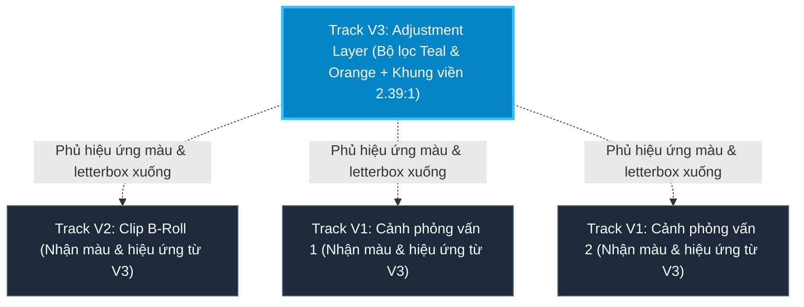
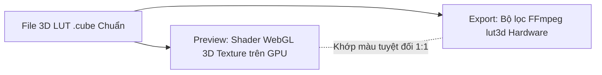

# Chỉnh màu, Hiệu ứng & Lớp điều chỉnh (Adjustment Layer)

  

KomfyEdit tích hợp bộ công cụ chỉnh màu chuyên nghiệp, thư viện bộ lọc 3D LUT điện ảnh (xử lý trực tiếp bằng WebGL trên GPU) và cơ chế **Lớp điều chỉnh (Adjustment Layer)** tiện lợi.

---

## 🎨 1. Chuyên đề: Lớp điều chỉnh (Adjustment Layer)

### Adjustment Layer là gì?
**Adjustment Layer** (Lớp điều chỉnh) là một lớp ảo trong suốt, bản thân nó không chứa video hay hình ảnh riêng biệt. Bạn có thể hình dung nó giống như một tấm kính lọc quang học đặt phía trên timeline.

> [!TIP]
> Bất kỳ hiệu ứng chỉnh màu, bộ lọc 3D LUT, hoặc hiệu ứng khung đen Letterbox nào áp dụng lên Adjustment Layer đều sẽ **tự động tác động lên toàn bộ các video, hình ảnh nằm ở các track phía dưới nó** trong khoảng thời gian nó phủ qua.

### Tại sao các thẻ Adjustment Layer lại xuất hiện trong danh sách Media?

  

Trong KomfyEdit, Adjustment Layer được lưu trữ như một Asset mẫu trong **khay Media** (có biểu tượng 3 lớp xếp chồng và huy hiệu **`Adj`**):
1. **Khi nào nó xuất hiện?**: Khi bạn vô tình hoặc chủ động bấm nút **`Adj`** trên thanh header của timeline (cạnh các nút `+ V`, `+ A`, `Subs`), hoặc chọn từ menu `Clip` → `Thêm lớp điều chỉnh (Add Adjustment Layer)`. Mỗi lần bấm, một thẻ Asset Adjustment Layer mới sẽ được tạo vào danh sách Media.
2. **Khả năng tái sử dụng**: Bạn có thể kéo thẻ này từ danh sách Media thả lên các track phía trên (`V2`, `V3`...) bao nhiêu lần tùy ý.
3. **Cách dọn dẹp nếu tạo thừa**: Nếu bạn lỡ tay bấm nhiều lần khiến xuất hiện nhiều thẻ thừa, chỉ cần **rê chuột vào thẻ đó và bấm biểu tượng Thùng rác** ở góc trên bên phải thẻ (hoặc chọn thẻ rồi bấm phím `Delete`). Việc xóa asset trong khay media không ảnh hưởng đến project nếu asset đó chưa được dùng trên timeline.

### Hướng dẫn sử dụng Adjustment Layer từng bước:
1. Nhấn nút **`Adj`** trên thanh header của timeline (hoặc kéo thẻ Adjustment Layer từ danh sách Media vào track `V2` hoặc `V3`).
2. Kéo dãn hai đầu mép của clip Adjustment Layer trên timeline sao cho phủ kín toàn bộ phân đoạn video bạn muốn áp dụng.
3. Chọn vào clip Adjustment Layer đó, sau đó nhìn sang **bảng Inspector** ở bên phải.
4. Chọn một **Bộ lọc 3D LUT** (ví dụ: *Film Classic*, *Vintage*, *Teal & Orange*) và kéo thanh **Intensity** (Cường độ từ 0% đến 100%).
5. Toàn bộ các cảnh quay phía dưới sẽ lập tức mang chung một tông màu điện ảnh đồng nhất mà không cần bạn phải chỉnh từng clip một!

---

## 🌈 2. Bảng chỉnh màu thủ công (Color Correction)

Bạn có thể tinh chỉnh màu sắc cho từng clip riêng lẻ hoặc cho toàn bộ Adjustment Layer:

| Thông số | Phạm vi | Mô tả công dụng |
|---|:---:|---|
| **Exposure (Phơi sáng)** | -2.0 đến +2.0 | Tăng hoặc giảm cường độ sáng tổng thể của khung hình. |
| **Brightness (Độ sáng)** | -100 đến +100 | Nâng hoặc hạ toàn bộ dải độ sáng một cách tuyến tính. |
| **Contrast (Độ tương phản)** | -100 đến +100 | Tăng độ chênh lệch giữa vùng tối và vùng sáng. |
| **Highlights (Vùng sáng)** | -100 đến +100 | Cứu lại chi tiết các vùng bị cháy sáng mà không làm tối vùng tối. |
| **Shadows (Vùng tối)** | -100 đến +100 | Kéo sáng chi tiết các vùng quá tối mà không làm lóa vùng trung tính. |
| **Temperature (Nhiệt độ)** | -100 đến +100 | Chuyển đổi sắc độ giữa Xanh lạnh (Cool) và Vàng ấm (Warm). |
| **Tint (Sắc thái)** | -100 đến +100 | Cân bằng sắc độ giữa Xanh lá cây (Green) và Hồng tím (Magenta). |
| **Saturation (Độ bão hòa)** | 0 đến 200% | Điều chỉnh độ rực rỡ của màu sắc (0% là đen trắng). |

---

---

## 🎬 3. Thư viện Bộ lọc 3D LUT Điện ảnh (Filters Library)

KomfyEdit sở hữu hệ thống bộ lọc màu 3D LUT tiên tiến được kết nối đồng nhất giữa **Bộ dựng WebGL trên GPU khi xem trước** và **Bộ lọc `lut3d` của FFmpeg khi xuất file**. Điều này đảm bảo **màu sắc khi xuất video khớp 100% từng điểm ảnh với màn hình xem trước**, khắc phục triệt để hiện tượng sai lệch màu thường gặp ở các phần mềm khác.

### Các tính năng nổi bật của Thư viện Bộ lọc:
Mở tab **Filters** trên bảng Thư viện bên trái:
1. **Phân loại danh mục phong phú (Categories)**:
   - **Featured**: Các bộ lọc màu ấn tượng được chọn lọc nhiều nhất.
   - **Cinematic**: Tái hiện gam màu phim bom tấn (*Teal & Orange*, *Kodak Portra*, *Fuji Chrome*, *Bleach Bypass*...).
   - **Retro & Vintage**: Phong cách máy ảnh phim cổ điển, màu ảnh thập niên 70s-90s, máy ảnh CCD hoài niệm.
   - **Portrait**: Làm mịn màng và tôn màu da tự nhiên, rạng rỡ.
   - **Night & Mood**: Sắc xanh ngọc lục bảo (Moody Emerald), tông đen huyền bí cho cảnh đêm và nhạc tâm trạng.
   - **Black & White (B&W)**: Monochrome Noir tương phản cao, Noir Film cổ điển.
2. **Tìm kiếm & Bộ lọc Yêu thích (Search & Favorites)**:
   - Nhập từ khóa vào ô tìm kiếm để lọc nhanh bộ lọc theo tên.
   - Bấm vào biểu tượng **Ngôi sao (`★`)** trên mỗi thẻ bộ lọc để lưu vào danh mục **Favorites**, giúp truy cập ngay lập tức trong các dự án sau.
3. **Rê chuột xem trước tức thì (Hover Preview)**:
   - Rê con trỏ chuột lên bất kỳ ô thumbnail bộ lọc nào trong thư viện: màn hình Program Monitor sẽ **lập tức hiển thị thử màu sắc đó trên chính khung hình hiện tại** của bạn mà chưa cần áp dụng thật!
4. **Thanh chỉnh cường độ (Intensity Slider)**:
   - Điều chỉnh thanh trượt **Intensity** từ `0%` (màu gốc) đến `100%` (hiệu ứng trọn vẹn) trực tiếp trong thư viện hoặc trong bảng Inspector để pha trộn màu vừa vặn nhất.
5. **Áp dụng cho tất cả (Apply to All)**:
   - Nhấn nút **"Apply to All"** để gán bộ lọc màu đã chọn lên toàn bộ các clip trên timeline chỉ với 1 cú nhấp chuột duy nhất.
6. **Nhập bộ lọc ngoài (Import Custom .cube LUTs)**:
   - Bạn có bộ sưu tập LUT cá nhân tải từ mạng hoặc mua từ các colorist? Chỉ cần chọn `Import LUT` hoặc kéo thả các tệp định dạng `.cube` vào khay bộ lọc để sử dụng vĩnh viễn trong KomfyEdit.

---

[← Quay lại: 03. Timeline & Cắt ghép](03-timeline-and-editing.md) · [Tiếp theo: 05. Âm thanh & Phụ đề →](05-audio-and-subtitles.md)
