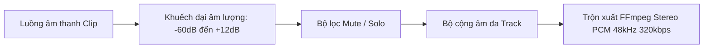
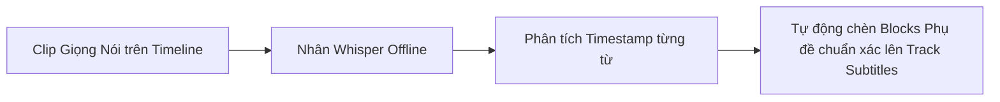

# Âm thanh & Phụ đề

  

Chất lượng âm thanh trong trẻo và phụ đề rõ ràng là hai yếu tố then chốt tạo nên một video chuyên nghiệp. KomfyEdit hỗ trợ trộn âm đa track, vẽ biểu đồ sóng âm (waveform) thời gian thực và quản lý phụ đề linh hoạt.

---

## 🔊 1. Trộn âm thanh & Hiển thị sóng âm (Waveforms)

Mỗi clip có âm thanh trên timeline đều tự động vẽ biểu đồ dạng sóng âm giúp bạn căn chỉnh chính xác từng câu nói, nhịp trống hay tiếng động.

### Các tính năng âm thanh chính:
1. **Âm lượng từng clip & Khuếch đại Audio Boost**:
   - Nhấp chọn clip trên timeline.
   - Kéo thanh trượt **Volume** trong bảng Inspector từ `-60 dB` (tắt hẳn) đến `+12 dB`.
   - **Audio Boost (+24 dB)**: Với các đoạn ghi âm quá nhỏ, bật công tắc Audio Boost để tăng âm lượng rõ ràng mà không làm mất chi tiết.
2. **Bộ giới hạn đỉnh chống rè (Brickwall Limiter)**:
   - Tự động kiểm soát các đỉnh âm thanh quá lớn, nén mượt mà các sóng âm vượt ngưỡng 0 dBFS, loại bỏ hoàn toàn hiện tượng méo tiếng (clipping distortion) khi xuất video.
3. **Tự động né tiếng / Giảm nhạc nền (Audio Ducking)**:
   - Khi có đoạn hội thoại hoặc giọng đọc trên track tiếng chính (`A1`), tính năng **Audio Ducking** sẽ tự động nhận diện và giảm nhỏ âm lượng của track nhạc nền (`A3`) xuống mức êm dịu, sau đó từ từ tăng lại khi hết câu thoại.
4. **Quản lý Track âm thanh**:
   - **Tắt tiếng (`M`)**: Tắt âm toàn bộ các clip trên track đó khi phát thử và khi xuất video.
   - **Độc tấu (`S` - Solo)**: Chỉ nghe một mình track này để kiểm tra tạp âm, tạm ngắt các track còn lại.
5. **Phân bổ track hợp lý**:
   - Track `A1`: Dành cho giọng nói / phỏng vấn chính.
   - Track `A2`: Dành cho tiếng động / hiệu ứng âm thanh (SFX).
   - Track `A3`: Dành cho nhạc nền du dương (BGM).

---

## 🎙️ 2. Tạo phụ đề tự động bằng AI Whisper (Offline 100%)

KomfyEdit tích hợp mô hình nhận dạng giọng nói **OpenAI Whisper chạy trực tiếp trên máy tính** thông qua nhân xử lý cục bộ:

- **Hoàn toàn ngoại tuyến & Bảo mật**: Không gửi âm thanh lên bất kỳ đám mây nào, hoạt động ngay cả khi ngắt kết nối Internet.
- **Cách sử dụng**:
  1. Nhấp chuột phải vào clip âm thanh/video hoặc chọn menu `Sequence` → `Tự động tạo phụ đề (Auto-Transcribe with Whisper)`.
  2. Chọn ngôn ngữ nguồn (Tiếng Việt, Tiếng Anh, hoặc Tự động nhận diện - Auto Detect).
  3. Bấm **Bắt đầu**: Hệ thống sẽ quét qua sóng âm và tạo một Track Subtitle hoàn chỉnh với các khối phụ đề khớp chuẩn từng giây phát âm!

---

## 💬 3. Quản lý Phụ đề & Mẫu chữ (Text Presets)

KomfyEdit hỗ trợ tạo track phụ đề chuyên dụng, hiển thị đẹp mắt và cho phép tùy chọn khắc cứng (burn-in) trực tiếp vào video khi xuất file.

### Thao tác với Track phụ đề
1. Nhấn nút **`Subs`** trên đầu track timeline để tạo một Track Subtitle mới (hoặc dùng tính năng Auto-Transcribe ở trên).
2. Nhấp đúp chuột vào bất kỳ vị trí nào trên track phụ đề để chèn một đoạn phụ đề mới tại đầu đọc playhead.
3. Nhập nội dung câu thoại trong bảng Inspector bên phải.
4. Kéo hai đầu của hộp phụ đề để khớp thời gian với giọng nói của nhân vật.

### Mẫu chữ & Tùy biến kiểu dáng (Text Presets & Styles):
- **Bộ mẫu chữ có sẵn (Text Presets)**: Chọn nhanh các phong cách thiết kế: *Cinematic Subtitles*, *Modern Bold*, *Karaoke Highlight*, *Neon Glow*, *Retro Box*.
- **Phông chữ (Font Family)**: Hỗ trợ đầy đủ phông chữ hệ thống máy tính.
- **Kích thước & Độ dày (Size & Weight)**: Chỉnh cỡ chữ to nhỏ, in đậm, nghiêng.
- **Màu sắc & Gradient**: Chọn màu chữ đơn sắc hoặc dải chuyển màu.
- **Viền chữ (Outline / Stroke)**: Đổ viền đen hoặc màu tương phản giúp chữ luôn nổi bật trên bất kỳ nền video nào.
- **Hộp nền (Background Box)**: Tùy chỉnh màu nền và độ mờ (opacity) cho khối nền sau chữ.
- **Đổ bóng (Drop Shadow)**: Tạo bóng mờ tạo chiều sâu chữ 3D.
- **Vị trí canh lề**: Tự do đặt cạnh dưới, giữa màn hình hoặc cạnh trên.

---

## 📥 4. Nhập & Xuất tệp SRT (SubRip)

- **Nhập tệp SRT**: Chọn `File` → `Import Subtitles (.srt)` hoặc kéo file `.srt` thả thẳng vào timeline. Hệ thống sẽ tự động phân tách thành các khối phụ đề chuẩn từng giây.
- **Xuất tệp SRT**: Chọn `Sequence` → `Export Subtitles (.srt)` để lưu lại tệp phụ đề rời tải lên YouTube, Facebook hoặc gửi đối tác dịch thuật.

---

[← Quay lại: 04. Chỉnh màu, Hiệu ứng & Adjustment Layer](04-color-effects-filters.md) · [Tiếp theo: 06. Xuất video →](06-export-and-delivery.md)
