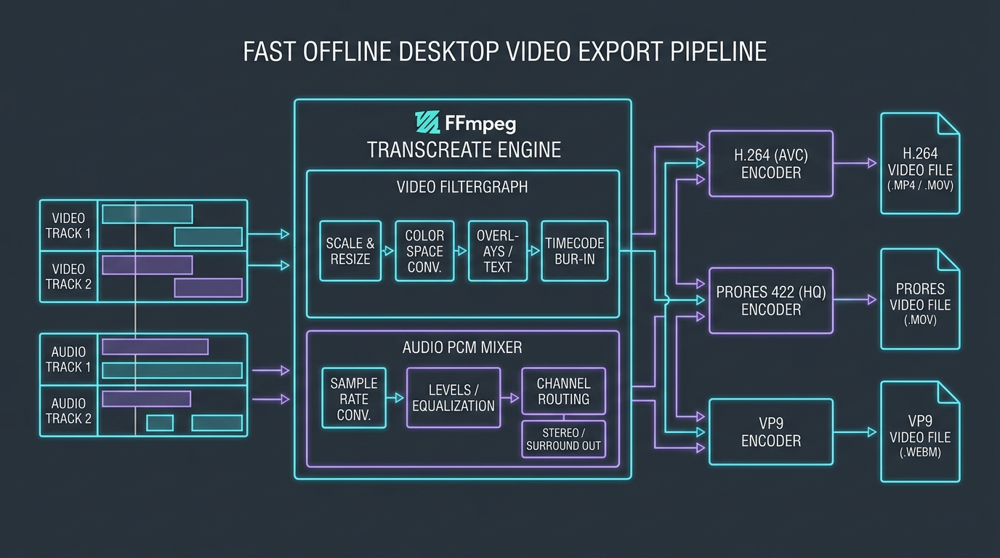
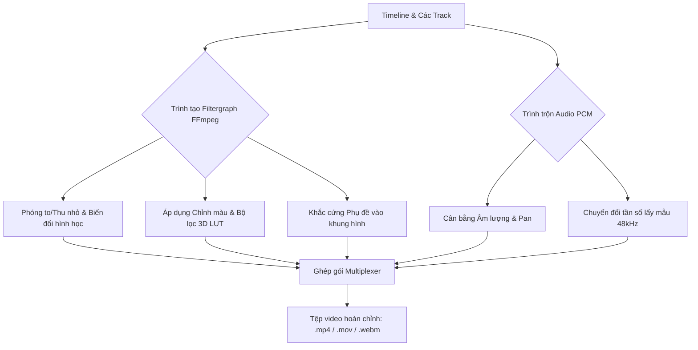
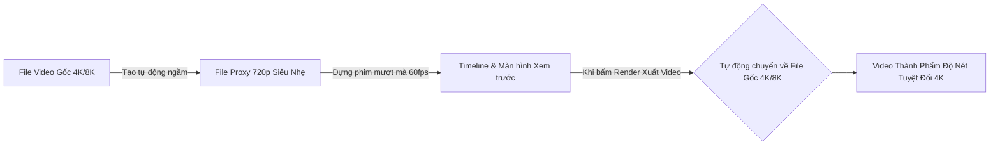

# Xuất video (Export & Rendering)

  

KomfyEdit sử dụng nhân xử lý **FFmpeg nhúng sẵn** cho phép render xuất video với tốc độ cao hoàn toàn offline ngay trên máy tính của bạn. Không đóng dấu watermark, không giới hạn thời lượng và không gửi dữ liệu lên bất kỳ máy chủ nào.

---

## ⚙️ 1. Mở cửa sổ xuất video (Export Dialog)

Bấm vào nút **`Export`** màu xanh nổi bật ở góc dưới bên trái hoặc nhấn tổ hợp phím `Ctrl + E` (`Cmd + E` trên macOS).

---

## 🎥 2. Lựa chọn định dạng & Codec

| Codec | Định dạng tệp | Mục đích sử dụng khuyên dùng | Tăng tốc phần cứng |
|---|:---:|---|:---:|
| **H.264 (AVC)** | `.mp4` | Tương thích hoàn hảo với mọi thiết bị di động, YouTube, Facebook, web. | Hỗ trợ (NVENC / Intel QuickSync / Apple VideoToolbox) |
| **Apple ProRes 422** | `.mov` | Chuẩn dựng phim chuyên nghiệp chất lượng gần như không suy hao. | Hỗ trợ (Apple Silicon VideoToolbox) |
| **VP9** | `.webm` | Chuẩn nén video nguồn mở hiện đại dành cho nền tảng web. | CPU (libvpx-vp9) |

---

## 📐 3. Độ phân giải & Tỉ lệ khung hình

Bạn có thể xuất theo kích thước chuẩn hoặc khớp hoàn toàn với thiết lập dự án:
- **4K UHD**: `3840 × 2160` (Chất lượng sắc nét tối đa).
- **1080p Full HD**: `1920 × 1080` (Chuẩn phổ biến nhất hiện nay).
- **720p HD**: `1280 × 720` (Xuất bản nháp nhanh hoặc file dung lượng nhẹ).
- **Video dọc (9:16)**: `1080 × 1920` (Dành cho TikTok, Reels, Shorts).
- **Video vuông (1:1)**: `1080 × 1080` (Dành cho bài đăng mạng xã hội).

---

## 🎚️ 4. Tùy chỉnh chất lượng (CRF vs Bitrate)

- **Hệ số chất lượng hằng định (CRF)**: Cách nén tối ưu nhất cho codec H.264.
  - `CRF 18`: Chất lượng cực cao, mắt thường không phân biệt được với bản gốc (file lớn).
  - `CRF 23`: Mức cân bằng hoàn hảo giữa độ nét và dung lượng file (mặc định).
  - `CRF 28`: Nén nhẹ dung lượng để gửi nhanh qua Zalo, Messenger.
- **Tần số âm thanh**: Mặc định xuất chuẩn phòng thu `320 kbps AAC` ở `48,000 Hz` Stereo.
- **Khắc phụ đề (Burn-in Subtitles)**: Bật tính năng này nếu bạn muốn chữ phụ đề được in vĩnh viễn lên từng khung hình của video.

---

## ⚡ 5. Tăng tốc phần cứng GPU (Hardware Acceleration)

KomfyEdit tự động thăm dò phần cứng và kích hoạt bộ mã hóa chuyên dụng của GPU nếu có:
- **NVIDIA GPU**: Sử dụng bộ mã hóa phần cứng `h264_nvenc` giúp tốc độ render nhanh gấp 4–8 lần so với CPU.
- **Intel CPU / Arc GPU**: Sử dụng công nghệ `h264_qsv` (Intel QuickSync Video).
- **Apple Silicon (Mac M1/M2/M3/M4)**: Tận dụng phần cứng `h264_videotoolbox` và `prores_videotoolbox` siêu tốc và tiết kiệm pin.
- **CPU đa nhân (Fallback)**: Tự động lùi về bộ mã hóa chất lượng cao `libx264` nếu máy tính không có card đồ họa tương thích.

---

## 🚀 6. Quy trình Proxy & Bộ nhớ đệm Render (Hiệu năng 4K/8K)

Khi làm việc với các thước phim độ phân giải siêu cao (4K/8K, bitrate 10-bit H.265/All-Intra) trên máy tính xách tay:

1. **Trình quản lý Proxy (Proxy Manager)**:
   - Nhấp chuột phải vào clip media → chọn **Tạo Proxy (Generate Proxy)**.
   - Ứng dụng sẽ mã hóa ngầm phiên bản 720p dung lượng nhẹ giúp timeline phản hồi tức thì, cắt cúp không có độ trễ.
   - Khi bấm **Export**, phần mềm sẽ **tự động liên kết lại tệp gốc 4K/8K** để render ra sản phẩm sắc nét tối đa mà không cần bạn phải thao tác lại bằng tay!
2. **Bộ nhớ đệm hiệu ứng (Render Cache)**:
   - Khi bạn áp dụng nhiều lớp bộ lọc 3D LUT, chuyển cảnh, hòa trộn và text cùng lúc, thanh màu trên timeline sẽ chuyển sang màu đỏ (chưa cache).
   - Hệ thống tự động biên dịch trước các đoạn này trong nền thành màu xanh lá cây (Cached) giúp phát mượt mà không bao giờ tụt khung hình.

---

## 📋 7. Hàng đợi xuất video (Render Queue) & Phân đoạn (Chapters)

- **Hàng đợi xuất file (Render Queue)**:
  - Thay vì phải ngồi chờ video render xong mới được làm việc tiếp, bạn có thể bấm **"Add to Queue"**.
  - Hàng đợi cho phép xếp lịch render hàng loạt nhiều dự án hoặc xuất đồng thời một video thành 2 phiên bản (bản 4K cho YouTube và bản 1080p dọc cho TikTok) chạy ngầm trong nền.
- **Xuất mốc phân đoạn (Chapter Markers)**:
  - Đặt các điểm đánh dấu (Marker) trên timeline và đặt tên chương (ví dụ: *00:00 Mở đầu*, *02:15 Hướng dẫn chi tiết*, *08:30 Kết luận*).
  - Khi xuất video, KomfyEdit có thể tự động nhúng các mốc chương này vào tệp MP4 hoặc tạo sẵn danh sách timestamp định dạng chuẩn để dán trực tiếp vào phần mô tả video trên YouTube!

---

[← Quay lại: 05. Âm thanh & Phụ đề](05-audio-and-subtitles.md) · [Tiếp theo: 07. Trợ lý AI EditPilot →](07-editpilot-ai-assistant.md)
