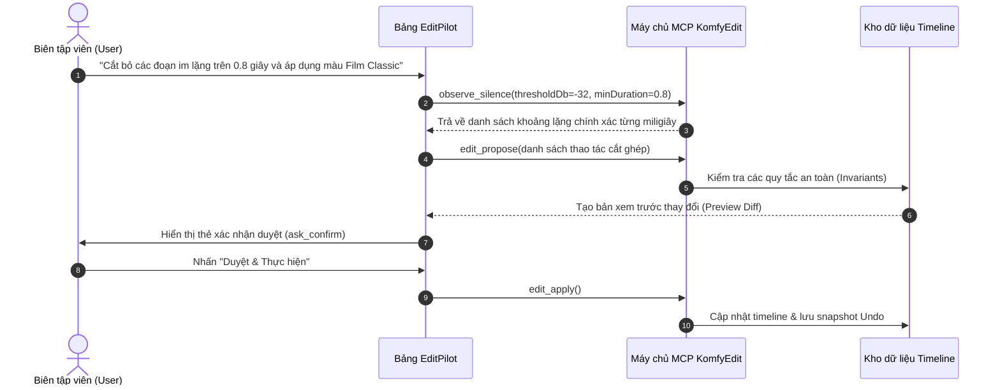

# Trợ lý AI EditPilot

  

**EditPilot** là bảng điều khiển trợ lý AI tích hợp sẵn trong KomfyEdit. Tính năng này cho phép các mô hình ngôn ngữ lớn (LLM) như Claude Code, Antigravity hoặc Codex giao tiếp trực tiếp với phần mềm thông qua chuẩn mở **Model Context Protocol (MCP)** để tự động hóa các tác vụ dựng phim tốn nhiều thời gian.

---

## 🤖 1. Nguyên lý hoạt động với Model Context Protocol (MCP)

Khác với các plugin thông thường dễ làm hỏng dự án, EditPilot kiểm soát mọi thao tác của AI thông qua một **Máy chủ MCP nội bộ** (`packages/komfyedit-mcp/`):

---

## 🛡️ 2. Các lớp bảo vệ an toàn dữ liệu & Đồng bộ trực tiếp (Live Sync)

EditPilot được thiết kế với các quy chuẩn an toàn khắt khe nhất để đảm bảo AI không bao giờ làm hỏng timeline của bạn:

1. **Một người ghi tại một thời điểm (Single-Writer Safety Lock)**:
   - Tránh xung đột giữa tính năng tự động lưu (Autosave) của ứng dụng và các thao tác ghi của AI. Khi AI thực thi, quyền ghi được kiểm soát tập trung, ngăn chặn triệt để tình trạng mất dữ liệu.
2. **Đồng bộ hóa trực tiếp vào giao diện (Live UI Sync)**:
   - Thay vì sửa file JSON trên đĩa rồi bắt người dùng phải tải lại dự án, máy chủ MCP chuyển tiếp các lệnh áp dụng (`edit_apply`) trực tiếp vào bộ nhớ Store của ứng dụng qua IPC. Bạn sẽ thấy **timeline cập nhật nhảy ngay trước mắt theo thời gian thực**!
3. **Người dùng luôn có quyền quyết định cuối cùng (`ask_confirm`)**: Mọi lệnh cắt hay xóa diện rộng đều phải đưa ra thẻ xác nhận (Confirm Card) với bản mô tả chi tiết (Diff) để người dùng đồng ý mới được thực thi.
4. **Bảo vệ track bị khóa**: Nếu track có biểu tượng ổ khóa (`🔒`), AI tuyệt đối không được phép chỉnh sửa trên track đó.
5. **Kiểm tra tính toàn vẹn (`qc_check`)**:
   - Chống sinh ra các đoạn cắt quá vụn (không cho phép đoạn nhỏ hơn 0.5s).
   - Đảm bảo tính liên tục của Track chính V1 (không để lại khoảng đen ngắt quãng).
   - Kiểm tra giới hạn thời lượng không vượt quá thời lượng file gốc.
6. **Hoàn tác tức thì một bước (`edit_undo` / `Ctrl + Z`)**: Toàn bộ chuỗi thao tác của AI được gói vào một thao tác nguyên khối (atomic batch), bạn có thể bấm `Ctrl + Z` để quay lại trạng thái cũ ngay lập tức.

---

## 🚀 3. Các tác vụ tự động hóa AI mạnh mẽ

### 1. Tự động cắt bỏ khoảng lặng (Jump-cut thông minh)
> *"Hãy tìm và cắt bỏ tất cả các đoạn im lặng hoặc ngập ngừng dài hơn 0.7 giây trên Track V1."*
- EditPilot sử dụng `observe_silence` quét phân tích dạng sóng âm và thực hiện chuỗi cắt ripple dồn timeline lại gọn gàng.

### 2. Tự động nhận diện cảnh quay (Scene Cut Detection)
> *"Phân tích video quay liên tục này và cắt rời từng phân cảnh khi có sự chuyển góc máy."*
- EditPilot gọi `observe_scenes` để phát hiện các bước nhảy ánh sáng giữa các khung hình và cắt chính xác điểm đổi góc quay.

### 3. Trích xuất khoảnh khắc đắt giá (Auto Highlight Extraction)
> *"Trích xuất cho tôi 30 giây những khoảnh khắc cao trào, giàu năng lượng nhất trong video sự kiện này để làm teaser TikTok."*
- EditPilot kích hoạt công cụ `extract_highlights`: kết hợp phân tích năng lượng âm thanh, cao độ giọng nói, nhịp độ chuyển động và cảnh quay để lọc ra các đoạn clip ấn tượng nhất.

### 4. Gợi ý chèn B-Roll ngữ cảnh (B-Roll Copilot)
> *"Tìm trong khay Media và gợi ý các clip B-Roll phù hợp chèn lên Track V2 tương ứng với nội dung người nói đang nhắc tới."*
- EditPilot dùng `suggest_broll` kết hợp với bản chép lời để đề xuất vị trí chèn hình ảnh minh họa đắt giá.

### 5. Tự động nhận diện giọng nói & Chèn phụ đề (Whisper Transcribe)
> *"Hãy bóc băng giọng nói trong video và tạo thành track phụ đề hoàn chỉnh."*
- EditPilot gọi công cụ `transcribe` để chạy mô hình Whisper offline, tự động tạo các khối phụ đề chuẩn từng giây trên timeline.

### 6. Tự động chọn lọc Bộ lọc màu & Nhãn dán
> *"Kiểm tra danh sách filter màu và áp dụng tông màu Cinematic cho cảnh quay ngoài trời."*
- EditPilot truy vấn `filter_list` và `sticker_list` để chọn phong cách phù hợp nhất với yêu cầu của bạn.

---

## 📖 4. Bảng tra cứu 22 Công cụ MCP (MCP Tools Reference)

Máy chủ nội bộ của KomfyEdit phơi bày 22 công cụ tiêu chuẩn cho trợ lý AI:

| Nhóm chức năng | Tên công cụ MCP | Mục đích hoạt động |
|---|---|---|
| **Đọc dữ liệu (Read)** | `project_list` | Liệt kê danh sách tất cả các dự án có trên máy. |
| | `project_open` | Mở một dự án cụ thể theo ID để chuẩn bị biên tập. |
| | `timeline_describe` | Mô tả chi tiết toàn bộ các track, clip, effect, filter và phụ đề. |
| | `timeline_summary` | Tóm tắt nhanh thời lượng, số lượng clip và cấu trúc timeline. |
| | `subtitle_list` | Đọc danh sách tất cả các câu phụ đề kèm timestamp. |
| | `media_list` | Liệt kê toàn bộ tài nguyên video, âm thanh, ảnh trong khay Media. |
| | `media_probe` | Đọc thông số kỹ thuật (độ phân giải, codec, fps, audio channels). |
| **Đo lường (Measure)** | `observe_silence` | Phân tích khoảng lặng âm thanh theo ngưỡng dB và độ dài tối thiểu. |
| | `observe_scenes` | Dò tìm điểm cắt chuyển cảnh theo ngưỡng biến đổi thị giác. |
| | `observe_loudness` | Đo cường độ âm lượng tích hợp chuẩn phát sóng (LUFS). |
| | `observe_filmstrip` | Trích xuất dải ảnh thumbnail các mốc thời gian để AI "nhìn" video. |
| **Trí tuệ AI (AI Skills)** | `transcribe` | Tự động bóc băng lời thoại thành phụ đề với mô hình Whisper offline. |
| | `extract_highlights` | Tự động phân tích và tìm các đoạn video ấn tượng, cao trào nhất. |
| | `suggest_broll` | Đề xuất các đoạn B-roll tương thích với ngữ cảnh câu nói. |
| | `qc_check` | Kiểm tra tính toàn vẹn timeline (phát hiện clip hỏng, track khóa, khoảng trống lạ). |
| **Tài nguyên (Assets)** | `filter_list` | Liệt kê danh sách các bộ lọc 3D LUT có trong thư viện. |
| | `sticker_list` | Liệt kê danh mục các nhãn dán đồ họa trang trí có sẵn. |
| **Tương tác (Interaction)**| `ask_confirm` | Hiển thị thẻ giao tiếp trên giao diện để hỏi ý kiến người dùng. |
| **Biên tập (Edit)** | `edit_propose` | Đề xuất một danh sách thay đổi (EditPatch) và sinh bản so sánh (Diff). |
| | `edit_apply` | Thực thi thay đổi trực tiếp lên Timeline trong bộ nhớ ứng dụng. |
| | `edit_undo` | Thu hồi thay đổi vừa thực hiện, đưa timeline về trạng thái trước đó. |
| **Xem trước (Preview)** | `render_preview` | Kết xuất một đoạn video ngắn để kiểm tra trực quan kết quả cắt ghép. |
| | `render_cancel` | Hủy bỏ tác vụ kết xuất xem trước đang chạy. |

---

[← Quay lại: 06. Xuất video](06-export-and-delivery.md) · [Về trang chủ tài liệu →](../README.md)
